# Championships

Racing League Tools provides maximum flexibility for creating and editing various championships.

Important: the database primarily consists of seasons. Each season is based on a specific championship. You cannot change the championship for a season once the season has been created. There can be as many seasons as you want in the database based on the same championship.

Some of the championship settings are applied to the season when it is created (some cannot be changed, others can be changed specific to the season), while others are championship-specific and changing them applies to all seasons based on that championship at once.

Initial information about championships and their components is stored in JSON files in the `startup_data` folder:

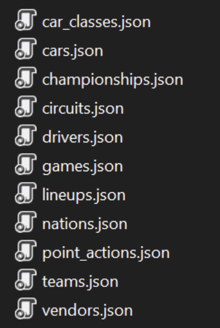

!!! info "Important"
    Please don't change the files in the `%app_folder/startup_data` folder! These are default files. You can create your own versions in the `%app_folder/user/startup_data` folder, which the app will prioritize.

After startup, RLT loads information from these files. You can see it on the **Championship** page:

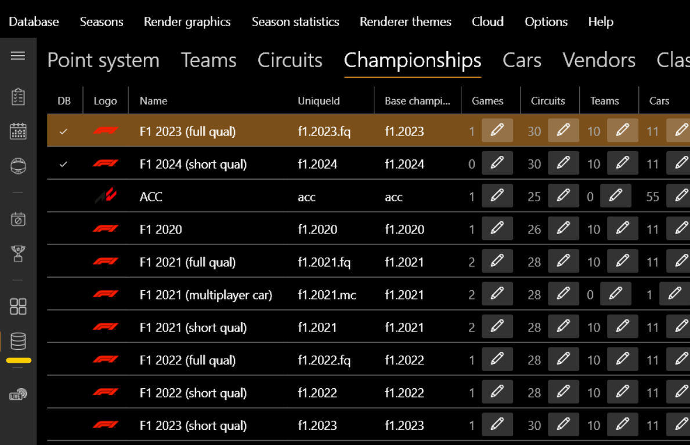

## Database (DB) vs Non-DB Championships

Note that championships are divided into those that are loaded into the league's database and those that are NOT loaded:

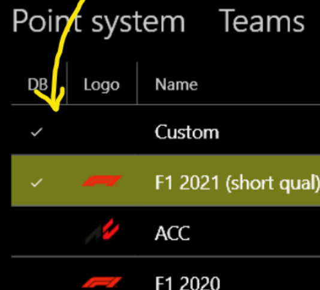

- **Database (DB) championships** store all related entities (teams, circuits, cars, games) directly in the database.
- **Non-DB championships** store their entities in JSON files (unless they are already in the database, determined by the `UniqueId` property).

This allows you to distribute JSON `startup_data` files so others can create new seasons based on an externally provided championship.

## Entities

Let's walk through the entities:

- **Classes** - Determine the class of the car. Used for logical grouping of different car classes and championships.
- **Vendors** - Car vendors. Used to logically group cars within the same class.
- **Cars** - Depends on the car class and vendor. Used directly in line-ups. You can associate a picture/logo for rendering.
- **Teams** - Position field determines the team's position in line-ups. You can associate a logo for rendering.
- **Circuits** - Detailed info for every circuit, including different versions.

### Creating a New Championship

There are 2 ways to create a new championship:

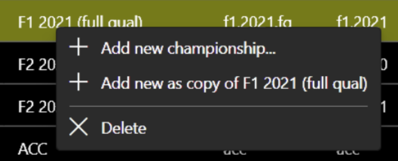

Using the buttons, you can add, change, or delete championship entities:

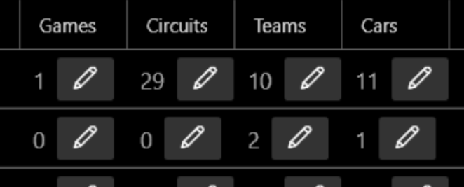

If you add an entity to a DB championship that is not yet in the database, it will be automatically loaded and associated with the championship for all its seasons:

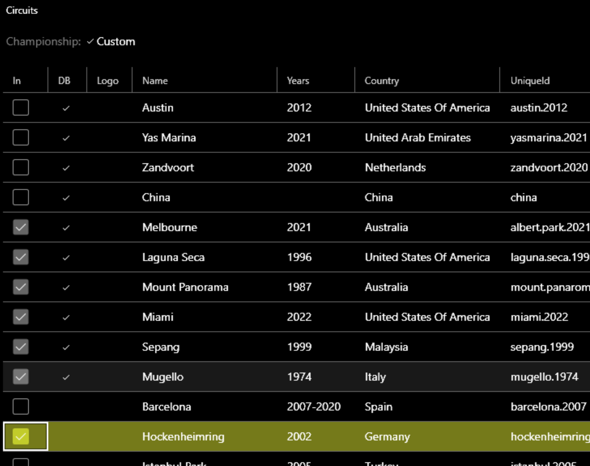

For a Non-DB championship, the app adds a link to the entity in the JSON file. To export all championships including teams and circuits:

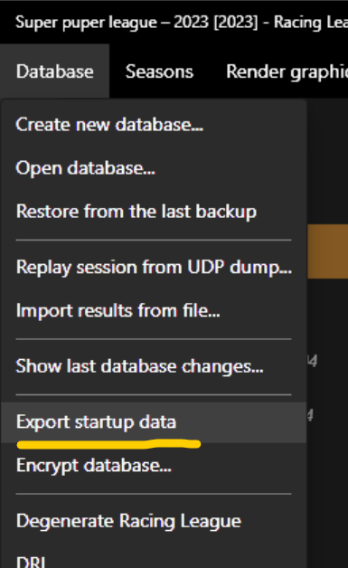

Files are saved to the `/user/startup_data/` folder.

Seasons based on the same championship share common entities (teams, cars, circuits, games). Changes to these (e.g., updating a team) for one season are automatically applied to other seasons of the same championship.

## Event Format

Each season consists of events, which can contain a different number of sessions (up to 3 races, 3 qualifications, and 1 practice). Each session has a specific type:

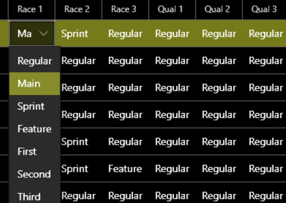

The type affects point calculations and differentiates the sessions. While the championship setting is used as a default, you can change the type for specific sessions or add/remove sessions within an event.

## Point System

On the **Point system** page, you can change the point scheme for each session type in the championship:

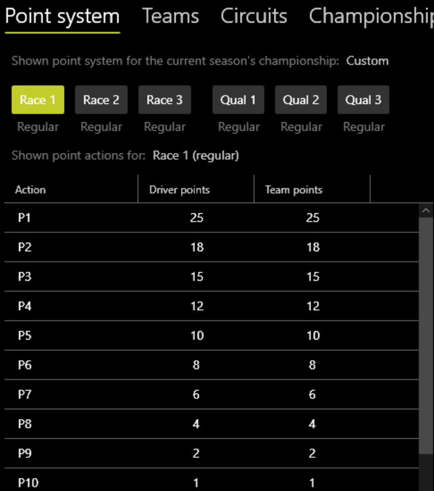

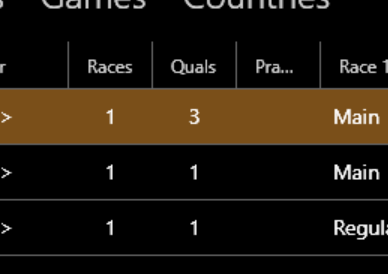

You can change the type for a specific session on the **Session results** page, which updates point calculations immediately:

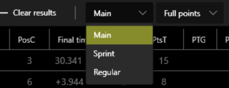

You can also add or remove sessions from an event at any time:

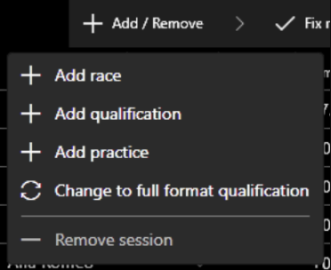

## F1 Full Qualification Format

RLT has convenient support for the full F1 qualification format. 

If your calendar isn't set to full qual but the app detects it during live timing, the event format automatically updates. A virtual session called **Combined Qual** is created to display combined results:

Rendered images also correctly display these combined results.

## Scoring Options

### Discard the Worst Events

This option helps equalize chances if drivers miss events due to technical problems. If set above 0, the specified number of worst results (in terms of points) will be discarded for ALL drivers in the season.

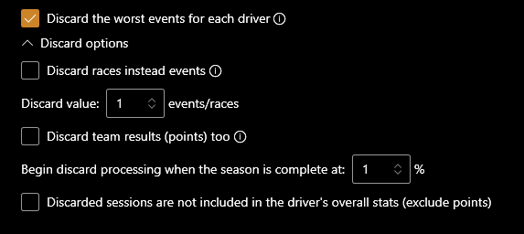

### Minor vs Major Type Races

In the point system, the option "Minor type races equals major type races for statistics" allows you to separate full races from sprints. If turned OFF, sprint races (minor type) will not be included in statistics like the total number of races, though they still award points according to the system.
