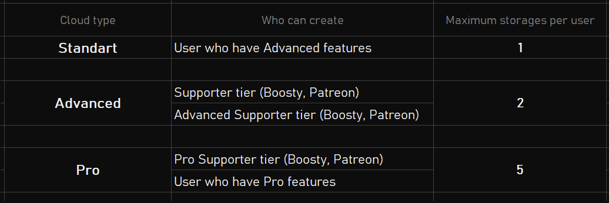
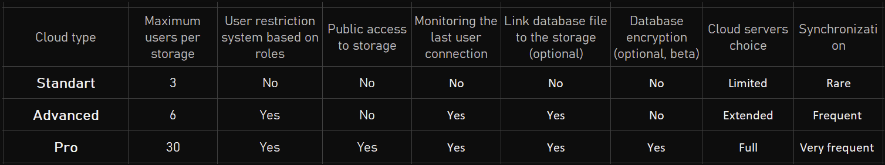
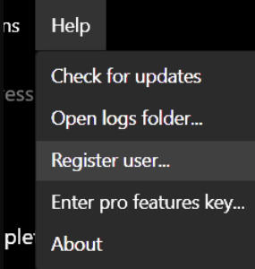
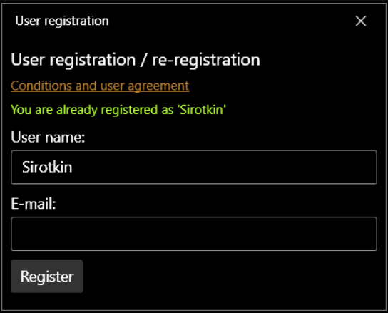
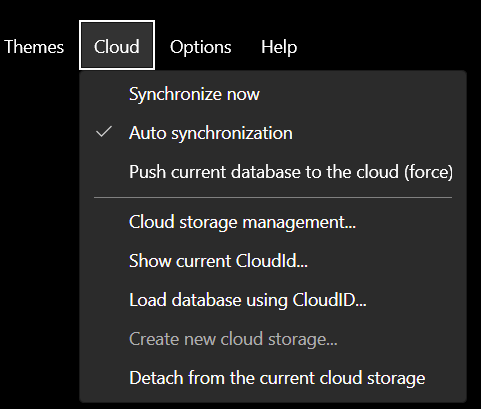
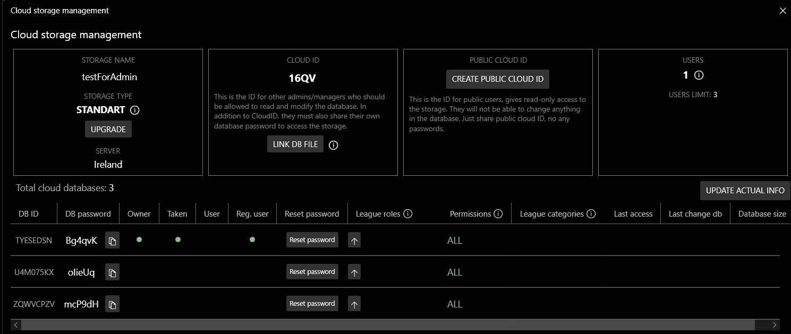
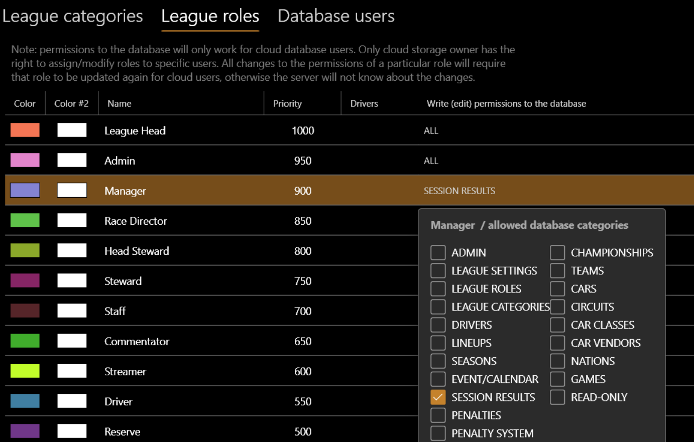
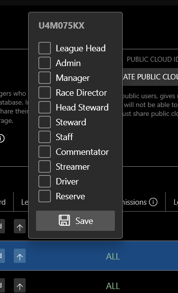

# Cloud Storage

**Share your database with different users using cloud storage.** See also the [video guide](https://www.youtube.com/watch?v=FDg9FgoGlDg).

## Basic terms

- **Cloud storage** — dedicated space on the cloud server to store all cloud user databases for a single league. Each storage has a unique Cloud ID.
- **Cloud slot / database** — a slot in the cloud storage, allocated to each cloud storage user.
- **Cloud storage owner** — the user who created the cloud storage. They have maximum access rights and the ability to manage it.

### How it works

All league information is stored in a single database file. You can use it standalone and offline. However, this makes it difficult when multiple users need to work on the same database. Racing League Tools provides a cloud-based system that automatically synchronizes the database file between different users. Within a set interval it checks whether changes have occurred, and if so, delivers the updated database file to all other users of the cloud storage.

### How to create cloud storage

First, you must be a supporter of the project on *Boosty* or *Patreon*, or have *Advanced* or *Pro* features.
To create a storage, you need to register in the app first ("*Help*" → "*Register user*"). Use the email you registered with *Boosty* or *Patreon* so the app can verify your support. Then choose "**Cloud**" → "**Create new cloud storage**" from the app's main menu.

## Storage types

Depending on your level of project support, you can manage different types of cloud storage: **Standard**, **Advanced**, and **Pro**:

> **Can I change cloud storage type after it has been created?**
> Yes. If you become a Boosty or Patreon subscriber, upgrade your tier to Pro Supporter, or get access to Pro Features, you can upgrade your cloud storages (where you are the owner).

> **What happens if I unsubscribe or Pro Features expire?**
> There may be a downgrade of your cloud storage (the type can change to Standard or Advanced). This can happen without notice, but at least one month after your support period has expired. Note that downgrading may remove Public Cloud ID and reduce the number of users by removing the oldest versions of the cloud databases. None of the cloud storages will be deleted after the end of support.

## User registration

There is a user registration option in the app. After registering, the app can detect if you have Boosty and Patreon subscriptions. The cloud storage **owner must be a registered user**. To register, simply enter your email address — you will receive a confirmation code.

To register, choose "**Help**" → "**Register user**":

!!! note
    You can re-register an unlimited number of times. This will prevent you from using the same account on many different devices simultaneously, but once you have unlocked Advanced or Pro features you may need to re-register so the server recognizes it.

## Storage owner

Only the storage owner can manage the storage through the "**Cloud Storage Management**" window. If necessary, you can transfer storage owner rights to another user (they must be registered using email). To transfer owner rights, right-click on the desired user and select "**Change owner**".

To delete storage, first select "*Detach from the current cloud storage*", then select "**Create new cloud storage**" and in the list of existing storages delete the desired one.

## Users

The number of users that can have access to edit the database is limited, depending on the type of storage (the *owner* is also counted as a user). After creating the storage, *pass the **Cloud ID** and corresponding slot **password** to each user*. No one can access the storage without a password. You cannot pass the same password to multiple users.

After registration in the cloud storage, the cloud database is linked to the user's hardware configuration. If you need to change the user, just reset the slot/DB password.

If the storage owner needs to register their email and be a project supporter, this is **not** required for other users — Cloud ID and slot password are sufficient to connect.

## User roles and permissions

*Available only for Advanced and Pro storages.*

You can restrict write access for certain database users. Go to the League Roles page, create or edit roles. For each role you can specify a different set of database categories for which write access is allowed. If no categories are specified, the role has full access to the database.

Any editing on the roles page will not change the actual access rights. To really set or change permissions you must open the "**Cloud Storage Management**" window (only the storage owner can do this). In this window you can set or change roles for specific users. The final set of categories available for editing is determined by the intersection of allowed categories across all roles assigned to the user.

**Important:** you can additionally set one or more *league categories* for a specific user. This will restrict access to editing seasons (all session results, events, season properties, line-ups) that share the same categories. If no categories are assigned, the user has access to edit all seasons.

After making any changes to league roles or league categories in the Cloud Storage Management window, remember to click the up arrow button to push those changes to the cloud server. Changes take effect when the end user restarts the app.

## Public cloud

*Available only for Pro storages.*

You can generate a public Cloud ID in the "**Cloud Storage Management**" window, then share it publicly. With this Public Cloud ID, other users can download your database in **read-only** mode — they cannot change anything, and most sensitive sections will be hidden. By default, only seasons, calendar, session results, line-ups, and penalties are visible.

The number of public users is unlimited. You can remove the Public Cloud ID at any time to revoke access.

## Last connection

*Available only for Advanced and Pro storages.*

After any user launches Racing League Tools and synchronizes, it updates a timestamp so that all other users can see the most recently connected user in the status bar.

## Database file linking

*Available only for Advanced and Pro storages.*

You can link your database file to a specific cloud storage. This creates a special mark in the database file indicating that it should not be opened outside the cloud storage, making it very difficult for other users to change the database by opening the file directly. Use this feature carefully if you plan to delete the cloud storage later.

## Database encryption

*Part of Pro features.*

After the encryption operation, the entire database file is encrypted with the password you specify. Select "**Database**" → "**Encrypt database**". This feature works for both offline databases and databases in cloud storage. If you encrypt a cloud storage database, all other users' passwords will be reset and they will lose access to the old version — a new password must be provided to them.

!!! warning
    This feature is in beta stage. If you forget the password, you may permanently lose access to the database. Use with caution.

After encryption, you can decrypt the database file back at any time.

## FAQ

> **I forgot my Cloud ID or password — how do I restore access?**

You must be the storage's owner.

1. If you have a fresh install of the app: create any test database.
2. If you haven't registered a user in the app: click "**Help**" → "**Register user**". Enter the email associated with the cloud storage owner.
3. Go to "**Cloud**" → "**Create a new cloud storage**". In the list you will find all your cloud storages, including their passwords.
4. Note the Cloud ID and password, close the window. Then press "**Cloud**" → "**Load database using CloudID**" and enter the Cloud ID and password.

*Note: you don't have to enter a password for your own storage — Cloud ID alone is sufficient.*

---

> **Why may the last changes disappear after synchronization?**

This can happen when different users change the database at the same time.

Since a primitive approach to cloud sync is used — exchanging the entire database file — the loss of recent changes during simultaneous writes is almost unavoidable.

The best ways to avoid this:

1. **Do not allow different users to perform write operations at the same time.**
2. Make sure the app has synchronized immediately before making changes ("**Cloud**" → "**Synchronize now**", not available for all storage types).

---

> **I get an "access denied" error when trying to load from the cloud.**

This is possible when a user tries to use the same Cloud ID and password on different computers. To fix this:

1. If you have been registered in the app before (confirmed email), try to re-register with the same email before attempting to load from the cloud.
2. Ask the storage's owner to reset the password for your slot and provide you with a new one.
