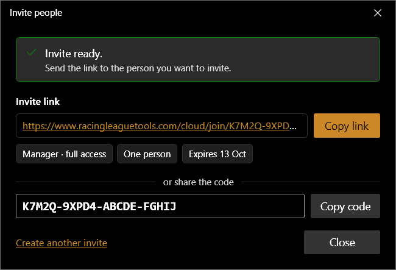
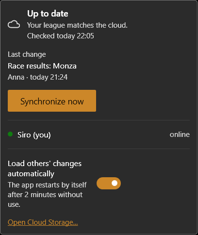
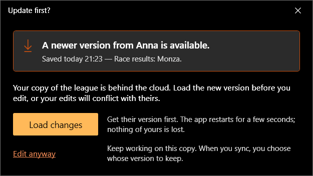
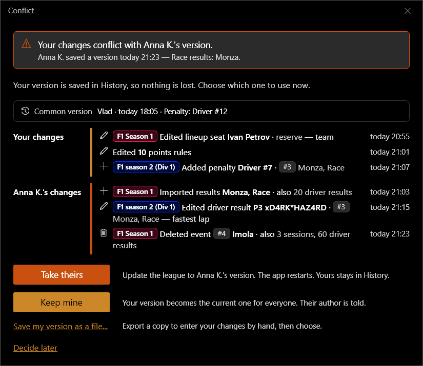
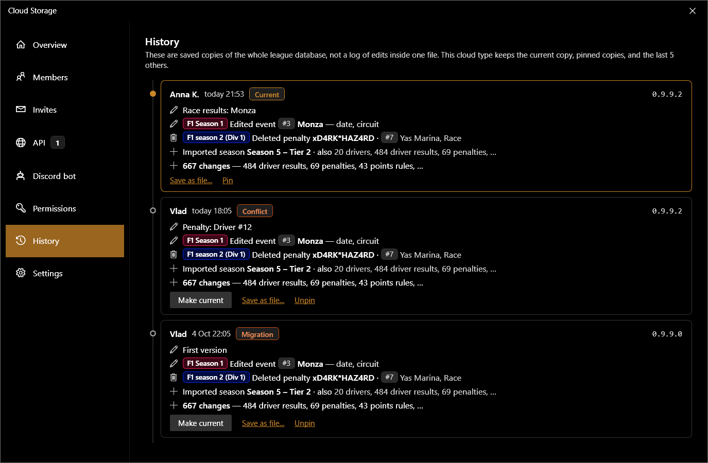
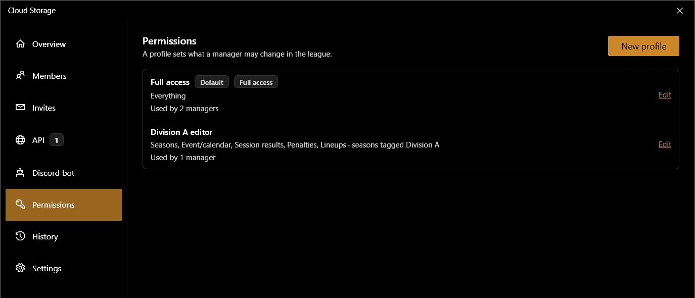
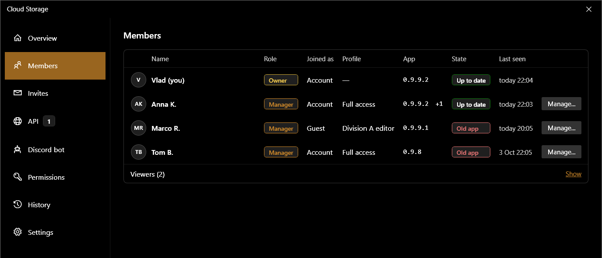
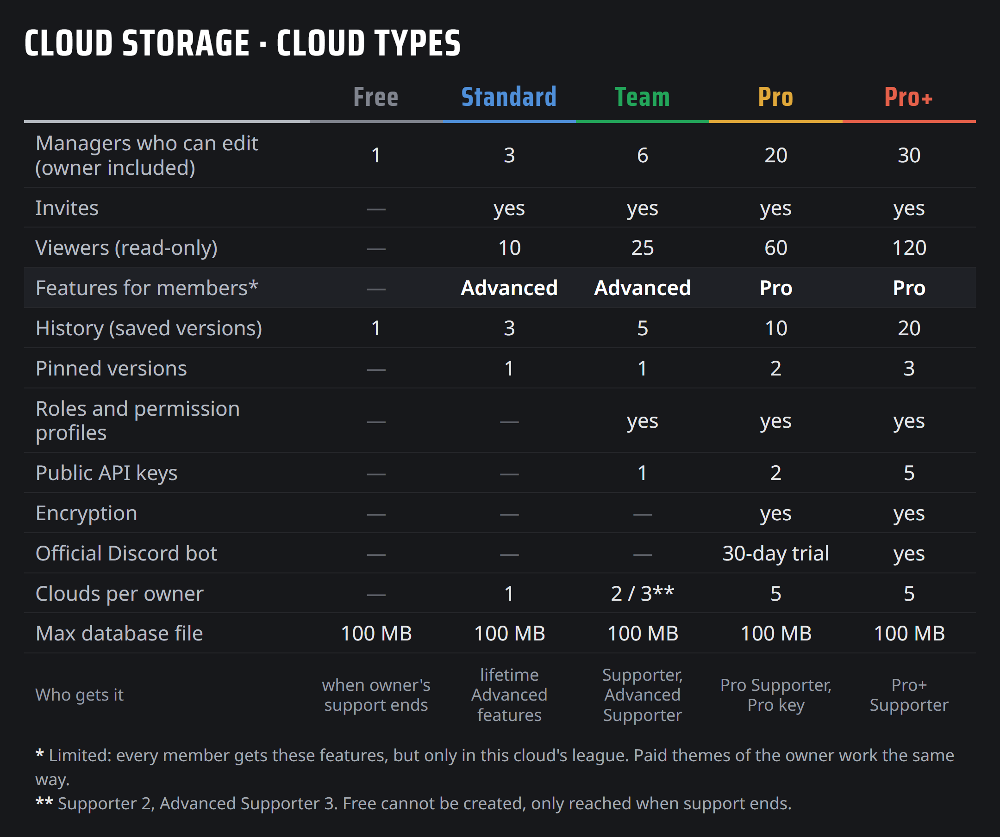
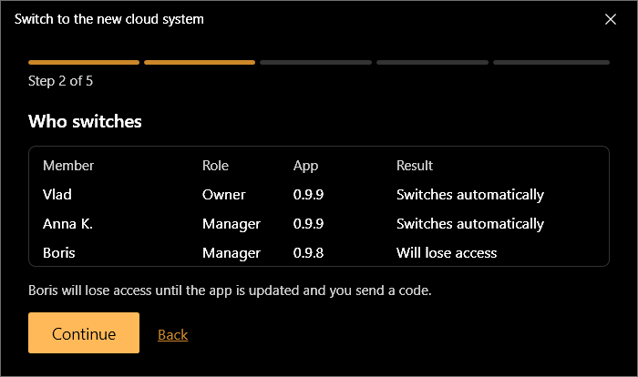

# Cloud Storage

**Cloud Storage** keeps one league database for several people. It is available in Racing League Tools **0.9.9** and newer.

## Quick Start

Creating a cloud requires access to **Advanced** or **Pro** features.

1. Open the league and select _Cloud_ -> _Create cloud storage..._.
2. The app uploads the league and opens the _Invite_ window.
3. Choose a role (_Manager_ or _Viewer_), press _Copy link_ and send the link to the person.

The invited person selects _Cloud_ -> _Join a cloud..._ and pastes the link. Joining with _Sign in and join_ is recommended over joining as a guest: a signed-in membership survives a Windows reinstall or a new PC.

All other cloud settings are in _Cloud_ -> _Open Cloud Storage..._.

## How It Works

The cloud synchronizes the **whole database file**, not separate changes. The file can always be taken and used offline.

- About **1 minute** after a change, the app publishes a new version. It also publishes when the app closes; a small progress window is shown.
- Nothing is published during a live session. Results go to the cloud when the session ends.
- While the app is active, it checks for a new version every 30 seconds.
- A new version is applied with a quick restart of the app. By default this happens automatically after 2 minutes without user activity, with a 10-second countdown and a _Not now_ button. The _Load others' changes automatically_ option is in the status bar flyout.
- Before applying any version, the app makes a local backup of the database.
- Without internet the app works as usual. Changes are published when the connection is back.
- The cloud keeps the latest versions of the league; the number depends on the cloud type.

Permissions are checked by the server, not only by the app.

## Who Is Online and Conflicts

The cloud indicator in the status bar shows the state of the league: _Up to date_, _N changes not published_, _Update available_, _Conflict_, _Offline_. Clicking it shows who is online, who is **editing** right now (and since when) and who is running a **live session**. Checking it before a big change is a good habit.

When editing starts on an old version, the app warns first: _A newer version from Anna is available_. Pressing _Load changes_ takes a few seconds and avoids a conflict.

If two people still publish at the same time, nothing is lost. The local version goes to _History_ and the indicator shows _Conflict_. Press _Resolve_ to see what each side changed and choose:

- _Take theirs_ - the local version stays in History.
- _Keep mine_ - available only to the owner or a manager with full access.
- _Save my version as a file..._ - saves the local file with all changes.

## History and Restore

History is not a log of edits: it stores saved copies of the whole league. Open the _Cloud Storage_ window -> _History_. Every version shows who published it, when, and what changed.

- _Make current_ - rolls the league back to this version. The version that was current before is pinned automatically, so it is possible to come back.
- _Save as file..._ - downloads any version as a normal database file, without touching the cloud.
- _Pin_ - a pinned version is never removed by the history limit. Pinning before something risky, such as a big import or a new season, is recommended.

The number of kept and pinned versions depends on the cloud type. The current and pinned versions do not count toward the limit. Only the owner and managers with full access can restore.

## Roles and Permission Profiles

- **Owner** - one per cloud, manages everything.
- **Manager** - edits the league, with full access or limited by a permission profile.
- **Viewer** - read-only. The app shows the league with edit buttons disabled.

**Permission profiles** (Team and above) are set in the _Cloud Storage_ window -> _Permissions_. A profile is a list of database categories (Season, Event, Session results, Penalty, Driver, Lineup and others), optionally narrowed by league category tags; a manager with such a profile can edit only seasons with these tags. A profile can be chosen already when creating an invite.

**Public read-only access** replaces the old Public Cloud ID. It is in the _Invites_ section: one code with the Viewer role and unlimited uses. Posted in a league Discord, it lets people follow the league in the app. The viewer limit of the cloud type still applies.

## Useful Details

- **Invite link.** Instead of a code, a link can be sent (_Copy link_). Opened in a browser, it explains what to do. If a code or link is in the clipboard, the start window of the app offers to join with it.
- **Change owner.** _Members_ -> member menu -> _Make owner..._. The new owner must be a signed-in member; a guest cannot be an owner. The cloud type changes to the new owner's type at once.
- **Lost guest access.** _Members_ -> _Re-issue access..._. The old access stops working, and a new code is sent.
- **Guest to account.** A guest can link the membership to an account later: _Settings_ -> _Link to my account_. The member's history is kept.
- **Devices.** _Members_ shows the app version of each member and how far behind it is (for example, _2 versions behind_).
- **Several leagues.** _Cloud_ -> _My clouds..._ switches between cloud leagues in one click.
- **Website.** The [account page](https://racingleaguetools.com/account/cloud-storages) shows all clouds the user belongs to, without the app.
- **Exit without publishing.** On close, this option keeps the latest changes only on this PC. Use it carefully.

## Cloud Types

The cloud type depends on the support level of the owner.

| | Free | Standard | Team | Pro | Pro+ |
| --- | --- | --- | --- | --- | --- |
| Managers (owner included) | 1 | 3 | 6 | 20 | 30 |
| Viewers | - | 10 | 25 | 60 | 120 |
| Invites | - | Yes | Yes | Yes | Yes |
| Features for members | - | Advanced | Advanced | Pro | Pro |
| History (saved versions) | 1 | 3 | 5 | 10 | 20 |
| Pinned versions | - | 1 | 1 | 2 | 3 |
| Permission profiles | - | - | Yes | Yes | Yes |
| Public API keys | - | - | 1 | 2 | 5 |
| Encryption | - | - | - | Yes | Yes |
| Official Discord bot | - | - | - | 30-day trial | Yes |
| Clouds per owner | - | 1 | 2 or 3 | 5 | 5 |
| Max database file | 100 MB | 100 MB | 100 MB | 100 MB | 100 MB |
| Who gets it | When the owner's support ends | Lifetime Advanced features | Supporter (2 clouds), Advanced Supporter (3 clouds) | Pro Supporter, Pro key | Pro+ Supporter |

A Free cloud cannot be created; a cloud becomes Free only when the owner's support ends. Clouds of the old system count toward the clouds-per-owner limit until they are switched or deleted.

### How the Type Changes

The type changes automatically with the owner's support. An upgrade is immediate. When support ends, the owner gets a notification and **7 days** of grace. After that the type goes down:

- Managers above the new limit become viewers (the last joined first) and get their access back when the type returns.
- New viewers and invites follow the new limits; members who are already in stay.
- History is trimmed to the new depth; the current and pinned versions are kept.
- Encryption stays on.

The league itself is never deleted because of a type change.

### What Members Get

Every member gets the owner's features in a **limited** form: Standard and Team give **Advanced** features, Pro and Pro+ give **Pro** features. Limited means the features work only in this cloud's league. For example, a member can render graphics or see statistics that need Pro, but cannot create an own cloud with it. Paid themes bought by the owner also work for all members, only in this league.

### Encryption

Available for Pro and Pro+: _Settings_ -> encryption. Nobody types a password; the app handles it for every member. It is basic protection, not a vault. While encryption is on, the **Public API and the Discord bot do not work**.

## Switching an Old Cloud

Old clouds (slots, Cloud ID and password) work only in 0.9.8 and earlier. After **1 December 2026** they are deleted automatically.

Only the owner can switch a cloud:

- In the app: open the league, _Cloud_ -> _Cloud storage management..._ -> _Switch to the new cloud system..._.
- On the website: the [account page](https://racingleaguetools.com/account/cloud-storages) -> the old cloud -> _Switch to the new Cloud Storage_.

The Cloud ID and league data stay the same. Members on 0.9.9 are switched automatically; members on older versions lose access and need a new invite after the switch. Slot permissions become permission profiles, the Public Cloud ID becomes a public viewer code, and API keys and Discord bot links stay. Asking all members to update the app before the switch saves time.

## FAQ

??? question "\"No free seat for that role\" when joining"
    The cloud reached the manager or viewer limit of its type. The owner can change roles or upgrade the cloud.

??? question "\"Update the app to get new data\""
    Someone published a version from a newer app. Select _Help_ -> _Check for updates_.

??? question "How to leave or delete a cloud?"
    To leave: _Cloud_ -> _Leave cloud storage..._. To delete (owner only): _Settings_ -> _Delete this cloud..._; deletion is immediate and cannot be undone. In both cases the local database stays on the PC.
