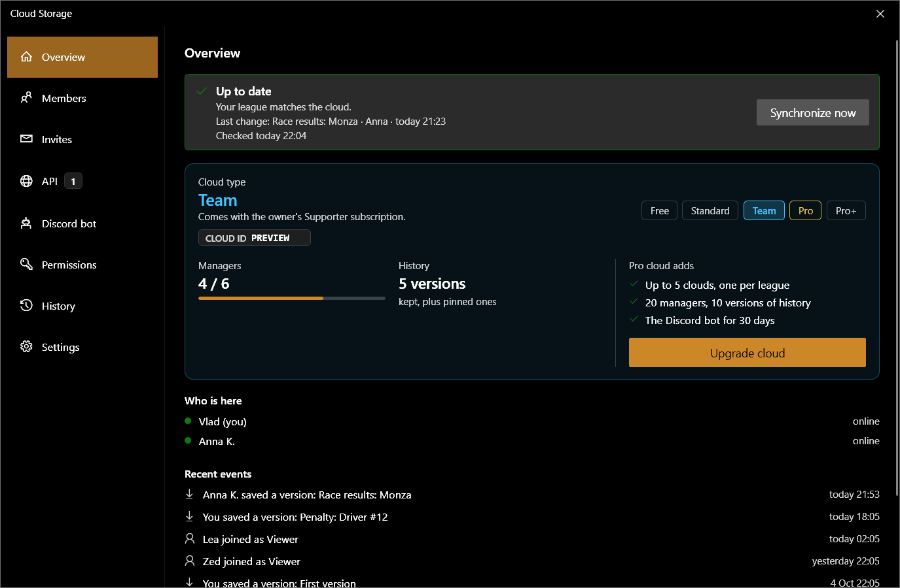

# Cloud Storage

Cloud storage v2, Racing League Tools **0.9.9** and newer.

## Quick start

To create a cloud you need access to **Advanced** or **Pro** features. How to get it: [support the project](https://discord.com/channels/904276286359347220/960444187403231262).

1. Open your league, **Cloud** -> **Create cloud storage...**
2. The app uploads the league and opens **Invite** window.
3. Choose role (**Manager** or **Viewer**), press **Copy link** and send it to other user.

User opens **Cloud** -> **Join a cloud...**, pastes the link and that's all.

Everything else about the cloud is in **Cloud** -> **Open Cloud Storage...**

## How it works

Cloud synchronizes **whole database file**, not separate changes. Same as before, so you can always take the file and use it offline.

- You change something, about **1 minute** later the app publishes new version. Also when you close the app (you will see small progress window).
- During live session nothing is published. Results go to the cloud when session ends.
- Other members check for new version every 30 seconds while the app is active.
- New version is applied with quick restart of the app. By default it happens by itself, when you don't touch PC for 2 minutes. You will see 10 seconds countdown with **Not now** button. Option **Load others' changes automatically** is in the status bar flyout.
- Before applying any version the app makes local backup of your database.
- No internet? Work as usual. Changes are published when connection is back.
- Cloud keeps last versions of the league (how many depends on cloud type). So you can always go back.

## Who is online, conflicts

Cloud indicator in the status bar shows state of your league: **Up to date**, **N changes not published**, **Update available**, **Conflict**, **Offline**. Click it and you see who is online, who is **editing** right now (and since when) and who runs **live session**. Before you start big work, look there.

If you start editing old version, the app asks first: *A newer version from User is available*. Better press **Load changes**, it takes few seconds.

If two people still published at the same time, nothing is lost. Your version goes to **History**, indicator shows **Conflict**. Press **Resolve**, you see what each side changed, and choose:

- **Take theirs** - your version stays in History.
- **Keep mine** - only owner or manager with full access.
- **Save my version as a file...** - your local file with everything.

## History and restore

History is not log of edits, it's saved copies of the whole league. **Cloud Storage** window -> **History**.
Every version shows who published it, when and what was changed.

- **Make current** - roll back the league to this version. Version which was current before is pinned automatically, so you can come back.
- **Save as file...** - download any version as normal database file. Useful to check something without touching the cloud.
- **Pin** - pinned version is never removed by history limit. Pin it before something risky, e.g. big import or new season.

How many versions are kept and how many you can pin - see cloud types below. Current and pinned versions don't count.

Only owner and managers with full access can restore.

## Roles and permission profiles

- **Owner** - one per cloud, manages everything.
- **Manager** - edits the league. Full access or limited by permission profile.
- **Viewer** - read-only. The app shows the league, edit buttons are disabled.

**Permission profiles** *(Team and above)*. **Cloud Storage** window -> **Permissions**. Profile is list of database categories (Season, Event, Session results, Penalty, Driver, Lineup...), optionally narrowed by league category tags. Then manager can edit only seasons with these tags. You can choose profile already when you create invite.

**Public read-only access** replaces old Public Cloud ID. It's in **Invites** section: one code with Viewer role and unlimited uses. Post it in your league Discord, people can follow the league in the app. Viewer limit of cloud type still applies.

## Things you may miss

- **Invite link.** Instead of code you can send link (**Copy link**). User opens it in browser and sees what to do. If code or link is in clipboard, the start window of the app offers to join with it.
- **Change owner.** **Members** -> owner menu on member -> **Make owner...** New owner must be signed in member, guest can't be owner. Cloud type changes to new owner's type at once.
- **Lost guest.** **Members** -> **Re-issue access...** Old access stops working, you send new code.
- **Guest -> account.** Guest can link membership later: **Settings** -> **Link to my account**. History of this member is kept.
- **Devices.** **Members** shows app version of each member and how far behind he is (e.g. *2 versions behind*). Good place to find who forgot to update.
- **Several leagues.** **Cloud** -> **My clouds...** switches between your cloud leagues in one click.
- **Website.** [racingleaguetools.com/account/cloud-storages](https://racingleaguetools.com/account/cloud-storages) shows all clouds you belong to, without the app.
- **Exit without publishing** on close - your last changes stay only on this PC. Use carefully.

## Cloud types

Type depends on support of the owner.

### How type changes?

Automatically, by support of the owner. Upgrade is immediate.
If support ends, you get notification and have **7 days**. Then type goes down:

- managers above new limit become viewers (last joined first), they get access back when type returns;
- new viewers and invites follow new limits, members already in stay;
- History is trimmed to new depth, current and pinned versions are kept;
- encryption stays on.

League itself is never deleted because of this.

### What do members get?

Every member gets features of the owner, but **limited**: Standard and Team give **Advanced** features, Pro and Pro+ give **Pro** features. Limited means they work only in this cloud's league. For example member can render graphics or see statistics which need Pro, but can't create own cloud with it.
Paid themes bought by the owner work for all members too, also only in this league.

### How many clouds can I own?

Standard - 1, Supporter - 2, Advanced Supporter - 3, Pro and Pro+ - 5. Old clouds count too, until you switch or delete them.

### Encryption (Pro, Pro+)

**Settings** -> encryption. Nobody types password, the app does it for everyone. It's basic protection, not a vault. While it's on, Public API and Discord bot **don't work.**

## Old cloud? Switch it before 1 December 2026

Old clouds (slots, Cloud ID + password) work only in 0.9.8 and earlier. After **1 December 2026** they are deleted automatically.

Only owner can switch:

- app: open the league, **Cloud** -> **Cloud storage management...** -> **Switch to the new cloud system...**
- or website: [racingleaguetools.com/account/cloud-storages](https://racingleaguetools.com/account/cloud-storages) -> your old cloud -> **Switch to the new Cloud Storage**

Same Cloud ID and same league data. Members on 0.9.9 are switched automatically. Members on older versions lose access, send them invite after switch. Slot permissions become permission profiles, Public Cloud ID becomes public Viewer code, API keys and Discord bot links stay.

Ask everybody to update the app before. It saves you time.

## FAQ

> *"No free seat for that role" when joining*

Cloud reached limit of managers or viewers for its type. Owner can change roles or upgrade the cloud.

> *"Update the app to get new data"*

Someone published version from newer app. **Help** -> **Check for updates**.

> *How to leave or delete the cloud?*

Leave: **Cloud** -> **Leave cloud storage...** Delete (owner): **Settings** -> **Delete this cloud...**, immediate, no restore. In both cases local database stays on PC.
