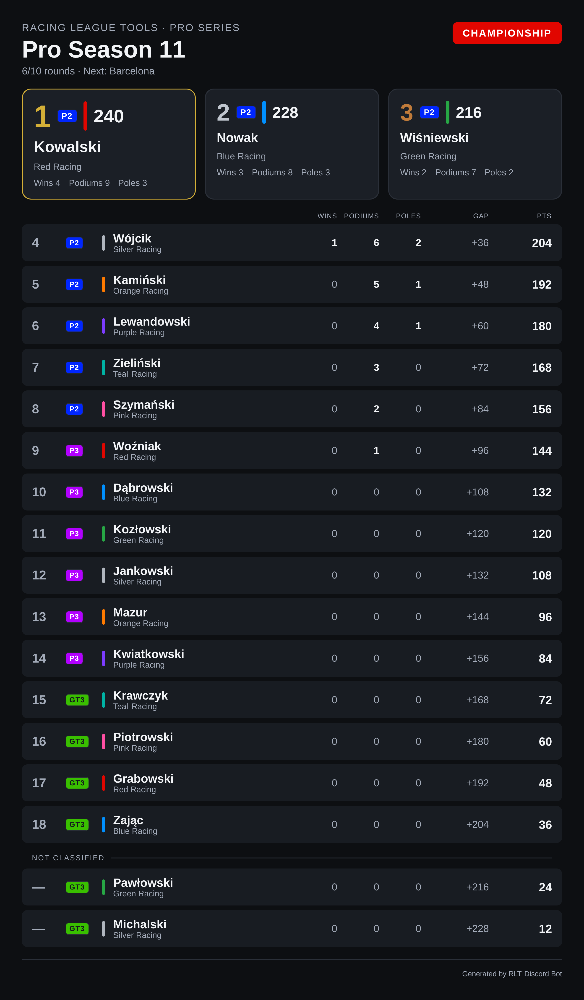
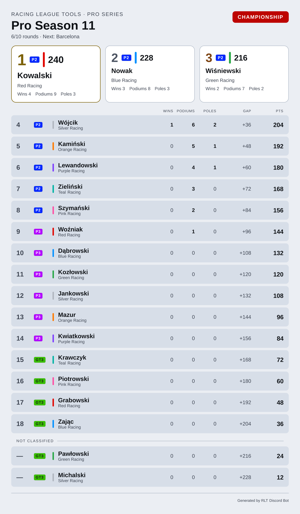
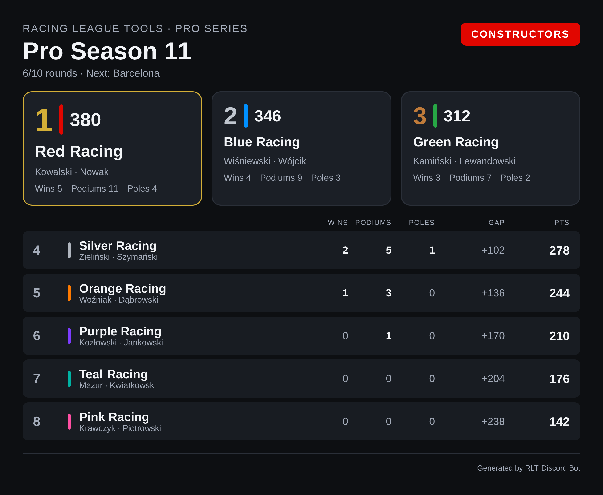
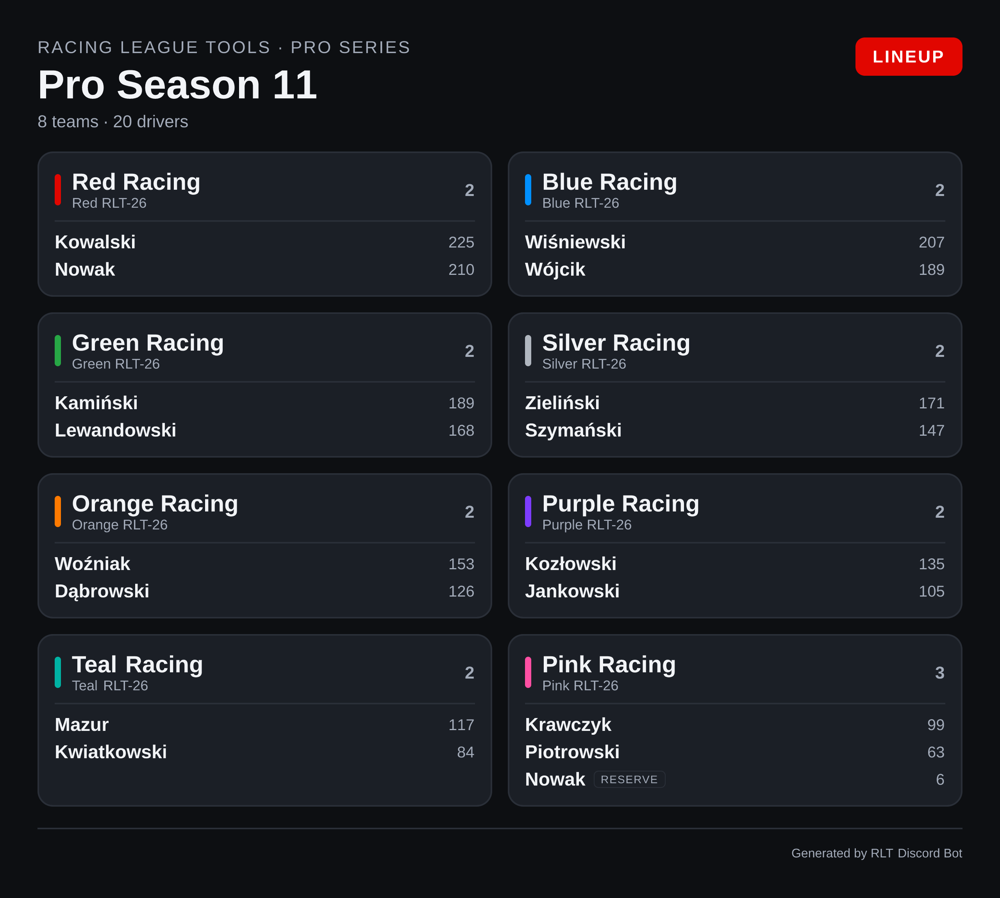
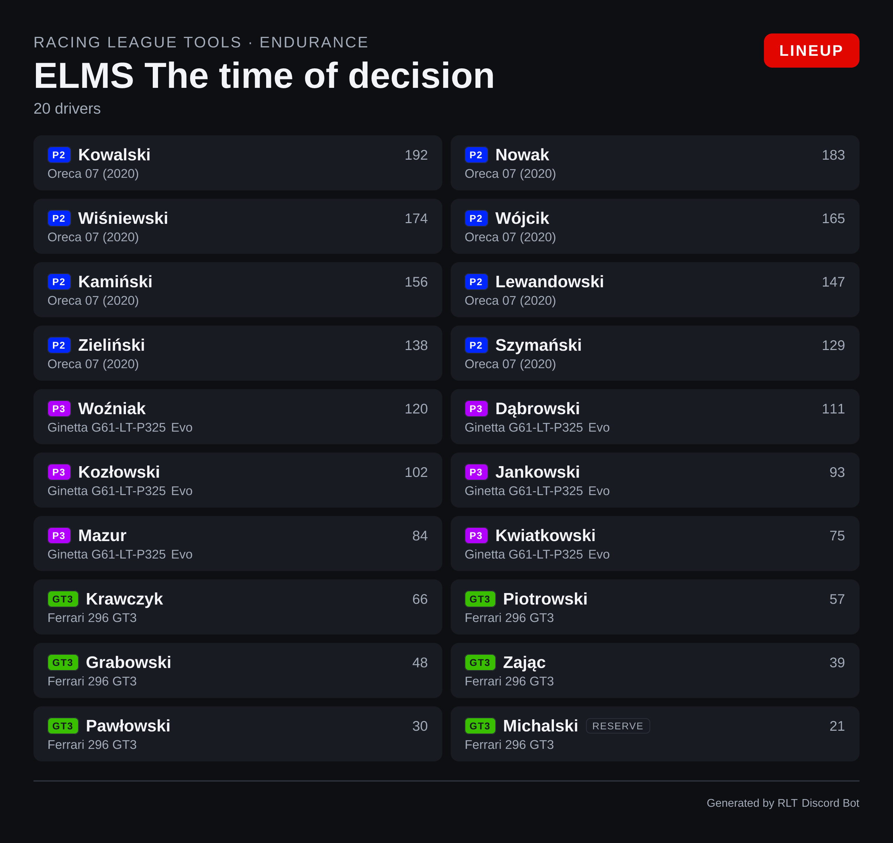
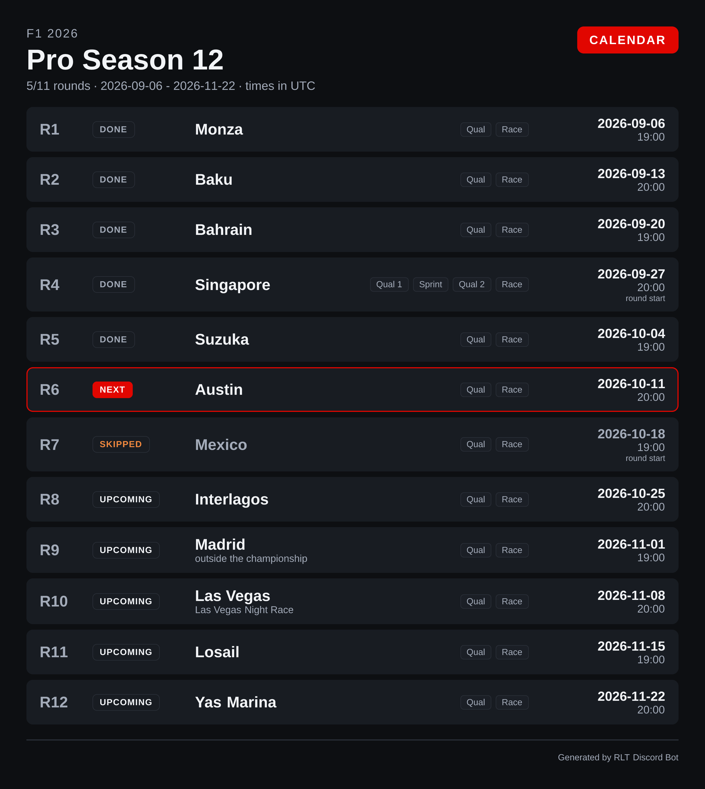
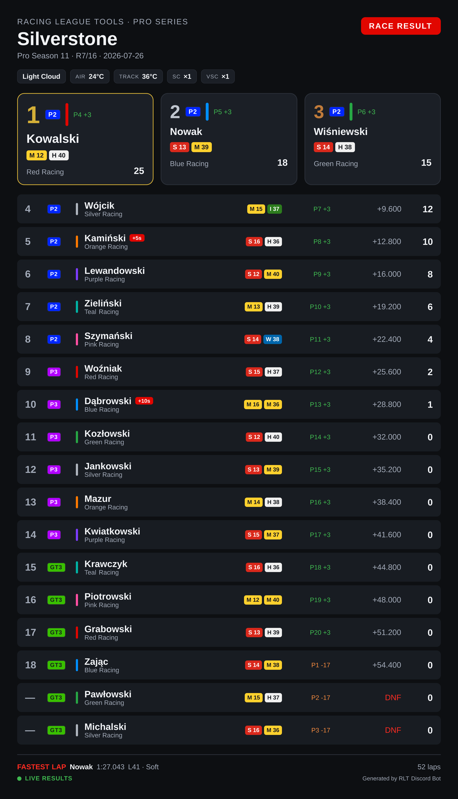
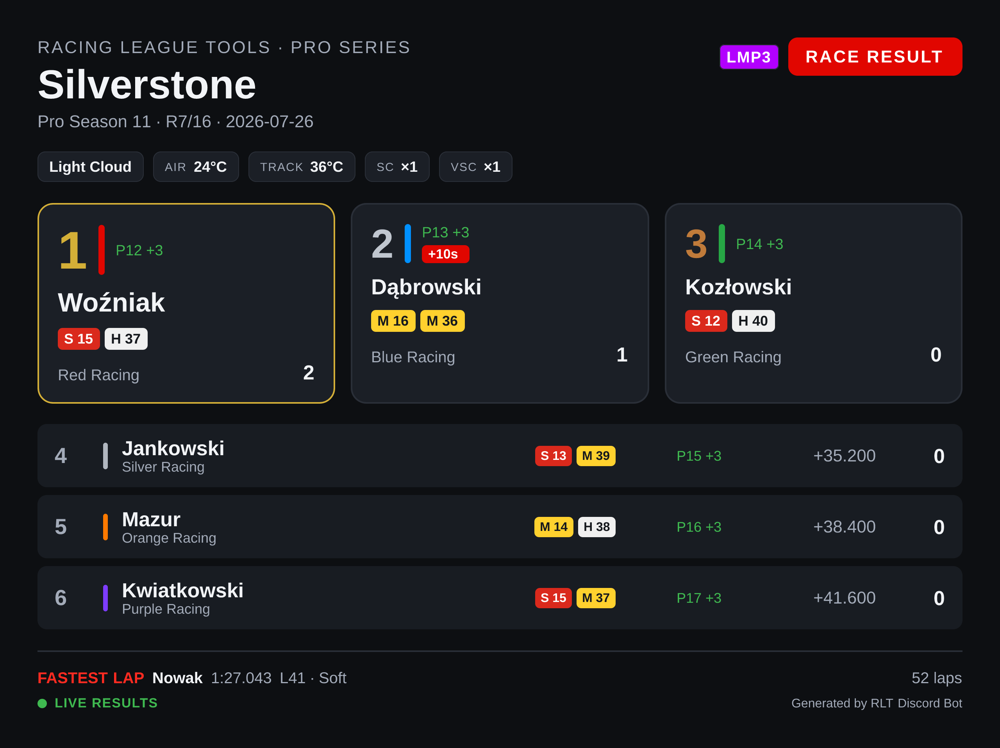

# Image cards

Seven commands upload your league data as a **PNG image** instead of replying with a text embed.
Every command whose name starts with `render-` belongs to this family; all the others are documented
under [Commands](commands.md).

They come in two groups. **Session cards** show one race or qualifying session; **season cards** show
a whole season at once.

| Command | Card | Text-embed counterpart |
|---|---|---|
| `/render-race-results` | Race result table | `/race-results` |
| `/render-qual-results` | Qualifying result table | `/qual-results` |
| `/render-race-highlights` | Session highlights (stat tiles) | — |
| `/render-race-strategy` | Tyre strategy (stint chart) | — |
| `/render-standings` | Championship standings | `/standings` |
| `/render-lineup` | Season lineups — who drives for whom | — |
| `/render-calendar` | Season calendar | `/season` |

The session cards take the same `season`, `round` and `session` options as the embed commands and
follow the same defaults — see
[How season, round and session are chosen](commands.md#how-season-round-and-session-are-chosen).
The season cards have no session to pick, so they take `season` and nothing else beyond their own
options.

!!! note "Sample data"
    The cards on this page are rendered from sample data, so the drivers, teams and tracks are made
    up. The layout is exactly what your league gets.

## Which form to use

Neither form is better; they are good at different things.

| | Text embed | Image card |
|---|---|---|
| Text can be selected, copied and searched in Discord | yes | no |
| Follows each reader's own Discord light/dark theme | yes | no — fixed by `/setup theme` |
| Reflows on narrow phone screens | yes | shown as a scaled-down preview, tap to enlarge |
| Team colours, tyre compounds, stint bars, podium boxes | no | yes |
| Shareable outside Discord as a single file | no | yes |
| Shows the whole field of a session, not just the top 10 | no | yes |
| Highlights, tyre strategy, lineups | not available | yes |

A common pattern is to post the embed right after a race for quick reading and discussion, and the
image card in a dedicated results channel, where it gets pinned and shared.

!!! note "Theme"
    The colour theme is a per-server setting, not a command option — see
    [Image card theme](settings.md#image-card-theme).

## Race result

```
/render-race-results
```


Reading the card:

* **Conditions bar** under the title — weather, air and track temperature, and how many times the
  safety car and virtual safety car were deployed.
* **Podium boxes** for the top three, each with the driver's team colour.
* **Tyre pills** — the compound of each stint and how many laps it lasted (`M 12`, `H 40`). White is
  Hard, yellow Medium, red Soft, green Intermediate, blue Wet.
* **Grid → finish**, e.g. `P4 +3` — started fourth, gained three places. Green for places gained,
  orange for places lost.
* **Time or gap**, then **points**.
* A red `+5s` badge next to a name marks a time penalty; `DNF` replaces the gap for retirements.
* **Footer** — fastest lap of the session, total laps, and a green **LIVE RESULTS** dot when the
  session came from telemetry.

The order and the position numbers follow the **official classification**, the one that counts after
penalties — see [How results are ordered](commands.md#how-results-are-ordered).

## Qualifying

```
/render-qual-results
```

=== "Dark"

    

=== "Light"

    

The layout matches the race card, with qualifying-specific columns: the pole box shows the pole time,
and each row carries the gap and the driver's best lap. Where the race card shows a gap to the
winner, qualifying shows `INT` — the interval to the driver **directly ahead**.

When the session was recorded from telemetry, the rows also carry the compound the best lap was set
on, the number of laps completed, and top speed.

## Session highlights

```
/render-race-highlights
```


Stat tiles for the session: top speed, best pace, most consistent driver, most overtakes, battles
won, pit stops with the compounds used, and total penalty time.

!!! warning "Needs telemetry"
    This card is built entirely from telemetry data. For a session whose results were entered by
    hand, the command says so and points you at `/render-race-results` instead.

## Tyre strategy

```
/render-race-strategy
```


A stint chart across the full race distance: one bar per driver, split by compound with the lap count
in each stint, and the number of pit stops on the right. Also needs telemetry.

## Championship standings

```
/render-standings
/render-standings type:Constructors
```

=== "Dark"

    

=== "Light"

    

The same classification the embed lists, with room for more of it: the top three get their own
boxes, and every row carries wins, podiums, poles, the gap to the leader and the points, with the
driver's team colour as a stripe. The subtitle counts the championship rounds and names the next one.

| Option | Meaning |
|---|---|
| `season` | Season. Omitted = current. |
| `type` | `Drivers` (default) or `Constructors`. |
| `class` | One class of a multiclass season — see [Multiclass seasons](#multiclass-seasons). |

`type:Constructors` swaps the drivers for teams, and each row's subtitle becomes that team's drivers:



!!! note "Drivers outside the classification"
    Racing League Tools numbers the classified entries 1..N and can leave others unnumbered — a
    reserve driver who scored in a one-off, for instance. Those rows keep their points but get a `—`
    instead of a position, under a **Not classified** heading at the bottom. Hiding them would eat
    somebody's points; calling them "0" would read like a position.

## Season lineup

```
/render-lineup
```



Who drives for whom this season, with each team's car and points per driver. A driver who is not in a
primary seat is marked **RESERVE**; a driver no team claims goes to a **No team** section at the
bottom.

| Option | Meaning |
|---|---|
| `season` | Season. Omitted = current. |

The card follows how your league is set up. A **team-based** league (F1-style) gets the team tiles
above. A **car-based** league — endurance, where the entry is a car rather than a team — has no teams
to show, so the card lists drivers in two columns with their car, grouped by class:



!!! note
    A season that hasn't started has no lineup yet: Racing League Tools publishes the teams, but no
    drivers. The command says so rather than drawing a grid of empty tiles.

## Season calendar

```
/render-calendar
/render-calendar view:Upcoming
```



Every round with its status, track, sessions and date.

| Option | Meaning |
|---|---|
| `season` | Season. Omitted = current. |
| `view` | `Full calendar` (default) or `Upcoming`. |

Reading the card:

* **DONE / NEXT / SKIPPED / UPCOMING** — the round's status as a word. The next unraced round is
  also outlined in the accent colour; a skipped round is dimmed, because it is the one status that
  means *this will not happen*.
* **Session pills** — the sessions of that round, in order. A sprint weekend shows `Qual 1 · Sprint ·
  Qual 2 · Race`, numbered exactly as the `session` autocomplete numbers them.
* **Date and time**, with `round start` under the time when Racing League Tools only publishes when
  the *round* begins rather than the race itself.
* **outside the championship** under a round that is on the calendar but scores no championship
  points.

!!! warning "Times are in UTC"
    A PNG cannot adapt to each reader's time zone the way Discord's live timestamps can, so the card
    states one zone in the header and sticks to it. For times in everyone's own zone plus a
    countdown, use the embed: `/season view:Upcoming`.

## Multiclass seasons

In a season with racing classes, every driver row on a card carries a **class badge** in the class's
own colour, and the class column takes its width from the name column so the table stays the same
width on a phone:



Nothing needs switching on. The badges appear when Racing League Tools reports classes for the
session or season, and a single-class season renders exactly as it did before.

### The `class` option

Three cards can narrow to one class: `/render-race-results`, `/render-qual-results` and
`/render-standings`. Pick the class from the autocomplete list.

```
/render-race-results class:LMP3
```



The card is then the classification **of that class**: positions are class positions, the fastest lap
is the class's fastest lap, and the class is named once as a pill in the header instead of being
repeated on every row. In a race, a driver a lap or more down shows `+1 Lap` rather than a time.

Two cards deliberately have no `class` option: `/render-race-highlights` and
`/render-race-strategy` compare the **whole** session — the tiles and the stint chart would change
meaning, not just lose rows.

!!! note "What Racing League Tools doesn't publish per class"
    `class` with `type:Constructors` says so instead of drawing an empty table: constructor standings
    exist per season, not per class. Text embeds (`/standings`, `/race-results`, `/qual-results`)
    show the class badges too, but have no `class` option — their tables are the overall
    classification, so the results top 10 can be ten drivers from the fastest class.

## Live sessions versus manually entered results

How much a **session** card can show depends on where the results came from, and that is decided
**per session** — a single season can contain both kinds. The season cards (standings, lineup,
calendar) don't depend on telemetry at all.

| | Recorded live (UDP telemetry) | Entered manually |
|---|---|---|
| Positions, times, gaps, points, best lap | yes | yes |
| Conditions bar (weather, temperatures, SC/VSC) | yes | — |
| Tyre pills and stints | yes | — |
| Grid → finish | yes | — |
| **LIVE RESULTS** marker | yes | — |
| `/render-race-highlights`, `/render-race-strategy` | yes | not available |

The same race, entered by hand — same classification, none of the telemetry extras:


!!! tip
    Recording sessions with live timing is what unlocks the highlights and strategy cards. See
    [Live Timing](../live-timing/hints.md) for how to set it up.
