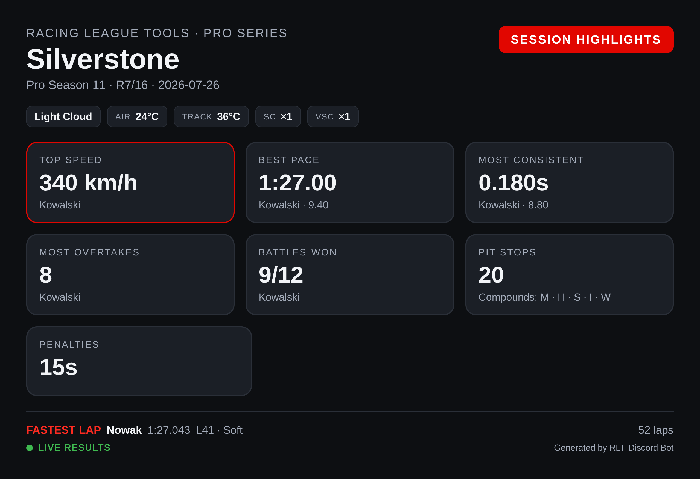
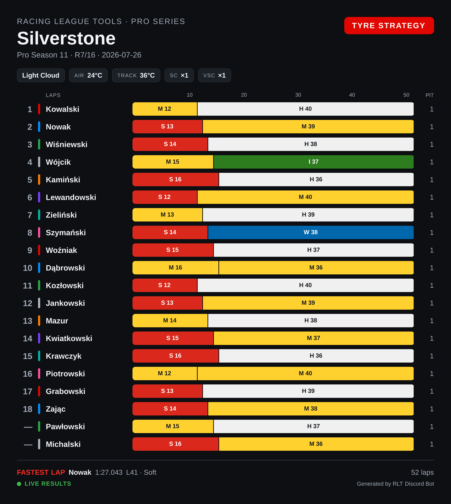
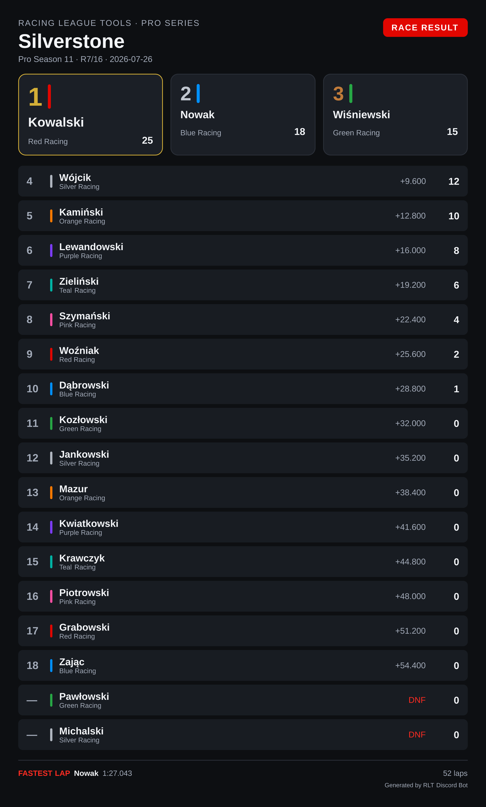

# Image cards

Four commands upload your session data as a **PNG image** instead of replying with a text embed.
Every command whose name starts with `render-` belongs to this family; all the others are documented
under [Commands](commands.md).

| Command | Card | Text-embed counterpart |
|---|---|---|
| `/render-race-results` | Race result table | `/race-results` |
| `/render-qual-results` | Qualifying result table | `/qual-results` |
| `/render-race-highlights` | Session highlights (stat tiles) | — |
| `/render-race-strategy` | Tyre strategy (stint chart) | — |

They take the same `season`, `round` and `session` options as the embed commands, and follow the
same defaults — see [How season, round and session are chosen](commands.md#how-season-round-and-session-are-chosen).

## Which form to use

Neither form is better; they are good at different things.

| | Text embed | Image card |
|---|---|---|
| Text can be selected, copied and searched in Discord | yes | no |
| Follows each reader's own Discord light/dark theme | yes | no — fixed by `/setup theme` |
| Reflows on narrow phone screens | yes | shown as a scaled-down preview, tap to enlarge |
| Team colours, tyre compounds, stint bars, podium boxes | no | yes |
| Shareable outside Discord as a single file | no | yes |
| Highlights and tyre strategy | not available | yes |

A common pattern is to post the embed right after a race for quick reading and discussion, and the
image card in a dedicated results channel, where it gets pinned and shared.

!!! note "Theme"
    The colour theme is a per-server setting, not a command option — see
    [Image card theme](settings.md#image-card-theme).

## Race result

```
/render-race-results
```


Reading the card:

* **Conditions bar** under the title — weather, air and track temperature, and how many times the
  safety car and virtual safety car were deployed.
* **Podium boxes** for the top three, each with the driver's team colour.
* **Tyre pills** — the compound of each stint and how many laps it lasted (`M 12`, `H 40`). White is
  Hard, yellow Medium, red Soft, green Intermediate, blue Wet.
* **Grid → finish**, e.g. `P4 +3` — started fourth, gained three places. Green for places gained,
  orange for places lost.
* **Time or gap**, then **points**.
* A red `+5s` badge next to a name marks a time penalty; `DNF` replaces the gap for retirements.
* **Footer** — fastest lap of the session, total laps, and a green **LIVE RESULTS** dot when the
  session came from telemetry.

## Qualifying

```
/render-qual-results
```

=== "Dark"

    

=== "Light"

    

The layout matches the race card, with qualifying-specific columns: the pole box shows the pole time,
and each row carries the gap and the driver's best lap. Where the race card shows a gap to the
winner, qualifying shows `INT` — the interval to the driver **directly ahead**.

When the session was recorded from telemetry, the rows also carry the compound the best lap was set
on, the number of laps completed, and top speed.

## Session highlights

```
/render-race-highlights
```



Stat tiles for the session: top speed, best pace, most consistent driver, most overtakes, battles
won, pit stops with the compounds used, and total penalty time.

!!! warning "Needs telemetry"
    This card is built entirely from telemetry data. For a session whose results were entered by
    hand, the command says so and points you at `/render-race-results` instead.

## Tyre strategy

```
/render-race-strategy
```



A stint chart across the full race distance: one bar per driver, split by compound with the lap count
in each stint, and the number of pit stops on the right. Also needs telemetry.

## Live sessions versus manually entered results

How much a card can show depends on where the results came from, and that is decided **per session** —
a single season can contain both kinds.

| | Recorded live (UDP telemetry) | Entered manually |
|---|---|---|
| Positions, times, gaps, points, best lap | yes | yes |
| Conditions bar (weather, temperatures, SC/VSC) | yes | — |
| Tyre pills and stints | yes | — |
| Grid → finish | yes | — |
| **LIVE RESULTS** marker | yes | — |
| `/render-race-highlights`, `/render-race-strategy` | yes | not available |

The same race, entered by hand — same classification, none of the telemetry extras:



!!! tip
    Recording sessions with live timing is what unlocks the highlights and strategy cards. See
    [Live Timing](../live-timing/hints.md) for how to set it up.
