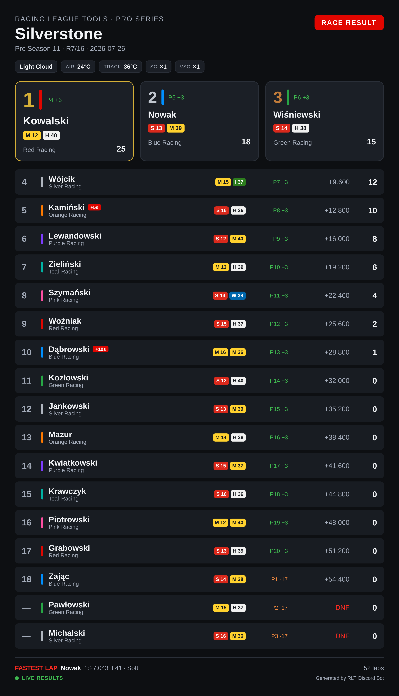

# Discord Bot

The official Racing League Tools Discord bot brings your league data straight into Discord.
Standings, race and qualifying results, driver profiles, head-to-head duels, the season calendar
and shareable image cards — all from slash commands, with no copy-pasting from the desktop app.

<figure markdown>
  
  <figcaption>An image card from <code>/render-race-results</code>. The same race is also one text
  command away — see <a href="#two-kinds-of-reply">Two kinds of reply</a>.</figcaption>
</figure>

## Two kinds of reply

Every command answers in one of two forms, and the command name tells you which:

*   **Text embeds** — everything except `/render-…`

    A normal Discord message: selectable, searchable text that follows each reader's own Discord
    theme and reflows on mobile.

    `/standings` · `/race-results` · `/qual-results` · `/driver` · `/head2head` · `/season` ·
    `/league`

*   **Image cards** — every command starting with `render-`

    A PNG the bot uploads to the channel. Built for pinning in a results channel or sharing outside
    Discord; the look is fixed by the server's [card theme](settings.md#image-card-theme).

    `/render-race-results` · `/render-qual-results` · `/render-race-highlights` ·
    `/render-race-strategy` · `/render-standings` · `/render-lineup` · `/render-calendar`

Race and qualifying results exist in **both** forms, so you can post the quick text version day to
day and the image card when it is worth framing:

| Data | Text embed | Image card |
|---|---|---|
| Race results | `/race-results` | `/render-race-results` |
| Qualifying results | `/qual-results` | `/render-qual-results` |
| Championship standings | `/standings` | `/render-standings` |
| Season calendar | `/season` | `/render-calendar` |
| Session highlights | — | `/render-race-highlights` |
| Tyre strategy | — | `/render-race-strategy` |
| Season lineups | — | `/render-lineup` |
| Driver profiles, head-to-head, league | embed only | — |

## What it can do

Through **embeds**:

* **Championship standings** — drivers or constructors, for any season.
* **Race and qualifying results** — podium, top 10, fastest lap or pole position.
* **Driver profiles** — career totals, a single season, or a group of seasons, plus telemetry ratings.
* **Head-to-head** — two drivers, or a team's own pairing, compared across ten metrics.
* **Season calendar** — round statuses and live countdowns to upcoming rounds.

Through **image cards**:

* **Race and qualifying results** — the full classification as a table.
* **Session highlights** — stat tiles for the session.
* **Tyre strategy** — a stint chart across the race distance.
* **Championship standings** — with wins, podiums and poles per row.
* **Season lineups** — who drives for whom, with cars and reserve drivers marked.
* **Season calendar** — every round with its status, sessions and date.

**Multiclass seasons** are supported throughout: class badges appear on their own wherever Racing
League Tools reports classes, and three of the cards can narrow to a single class — see
[Multiclass seasons](image-cards.md#multiclass-seasons).

Every reply is in your language: the bot speaks English and Polish, selected per server with
`/setlang`. That covers both forms — embed text and the labels drawn on the image cards.

## Before you start

You need three things:

| Requirement | Details |
|---|---|
| A **Pro Plus** league | The Public API is available on Pro, but the official bot requires **Pro Plus**. |
| **Manage Server** permission on Discord | Needed to invite the bot and to run `/setup` and `/setlang`. Everyone else can use the data commands. |
| A **pairing code** from RLT Desktop | Single use, expires after 60 minutes. |

## Quick start

1. In **RLT Desktop**, generate a pairing code for the official Discord bot. The invite link for the
   bot is shown there as well.
2. **[Invite the bot](invite.md)** to your Discord server.
3. Run **`/setup link code:<YOUR-CODE>`** in that server — see [Link your league](linking.md).
4. Check it worked with **`/setup status`**, then try `/standings`.

That is the whole setup. Nothing to host, nothing to configure, no API key to copy anywhere.

!!! note
    The bot only ever answers slash commands. It does not post on its own, does not read channel
    history, and does not manage roles or members.

## Where to go next

* [Invite the bot](invite.md) — the invite link and what permissions it asks for.
* [Link your league](linking.md) — pairing codes, checking the link, unlinking.
* [Commands](commands.md) — every command, its options, and what the defaults do.
* [Image cards](image-cards.md) — the seven PNG cards, with examples.
* [Server settings](settings.md) — language, card theme, archived seasons.
* [Troubleshooting](troubleshooting.md) — what the bot's messages mean.
