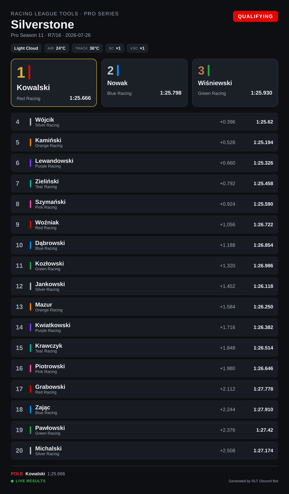
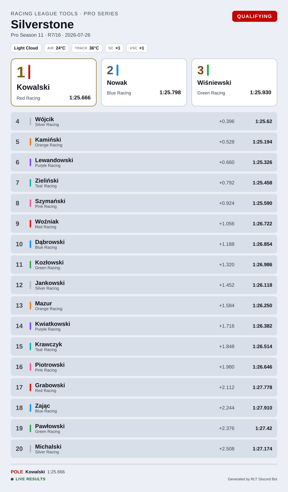

# Server settings

Three settings, all per server, all requiring the **Manage Server** permission. Replies are private.

## Response language

```
/setlang language:English
/setlang language:Polski
```

Sets the language of everything the bot says on that server — embeds, image card labels and error
messages alike.

If you never run `/setlang`, the bot follows your Discord server's own language setting, and falls
back to English.

!!! note
    Command **names** and **option names** are always English — they are the identifiers Discord
    itself uses. The command *descriptions* you see in the Discord command picker follow **your own**
    Discord client language, not the server's `/setlang` choice. Only the bot's replies follow
    `/setlang`.

## Image card theme

```
/setup theme name:Dark
/setup theme name:Light
```

Picks the colour theme for the [image cards](image-cards.md). **Dark** is the default. **Light** has
noticeably more readable small text, because Discord scales image previews down to a fixed width and
small grey labels on a dark card suffer for it.

Run any `/render-…` command afterwards to see the change.

=== "Dark"

    

=== "Light"

    

## Archived seasons in autocomplete

```
/setup show_archived_seasons enabled:false
```

Every command with a `season` option suggests your league's seasons as you type. In a league with a
long history that list is mostly archive, which makes finding the current season tedious. Turning
this off leaves only active seasons in the suggestions.

Two things it deliberately does **not** do:

* It does not block access. An archived season still works if its ID is entered directly — this is a
  display preference, not a restriction.
* It never leaves you with an empty list. If your league has no active season at all, the full list
  comes back, because empty suggestions read as "the bot can't see my league".

Archived seasons are suggested by default.

!!! tip
    You can also just type to filter. Entering `archive` narrows the suggestions to archived seasons
    (or `archiwum` when the bot is set to Polish).
