# Drivers

Some hints related to drivers and the drivers page.

## Categories (tiers, divisions, etc.)

**Dividing the league into categories (tiers, divisions, etc.):**

Go to the **Categories** tab:

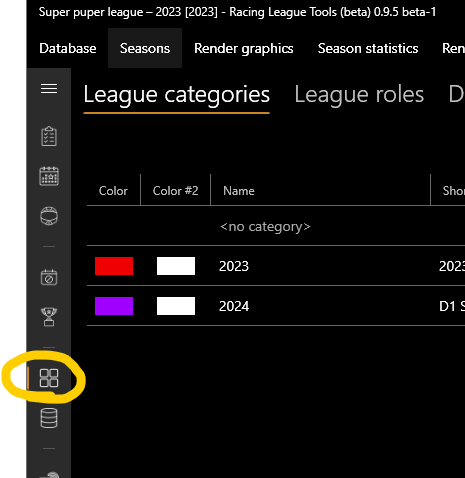

- Add new categories:

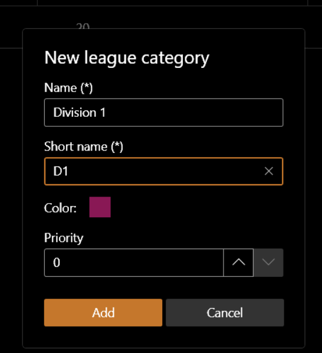

- Or import standard/default categories:

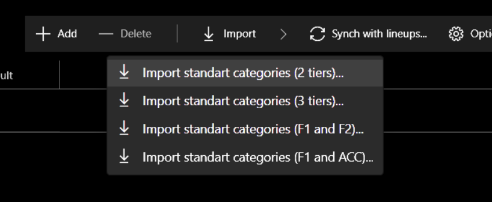

Priority affects the order of the category **and seasons** on the lists.

You can also set useful options such as:

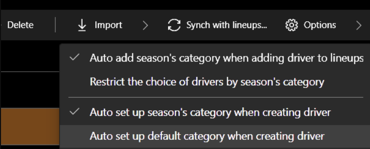

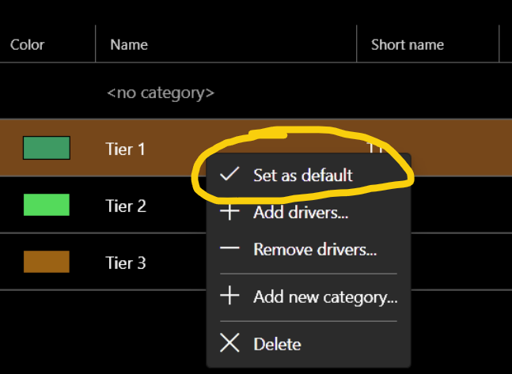

Each driver can have different categories:

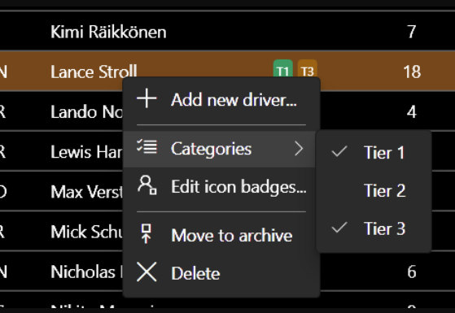

On the **Categories** tab you can manage the driver categories:

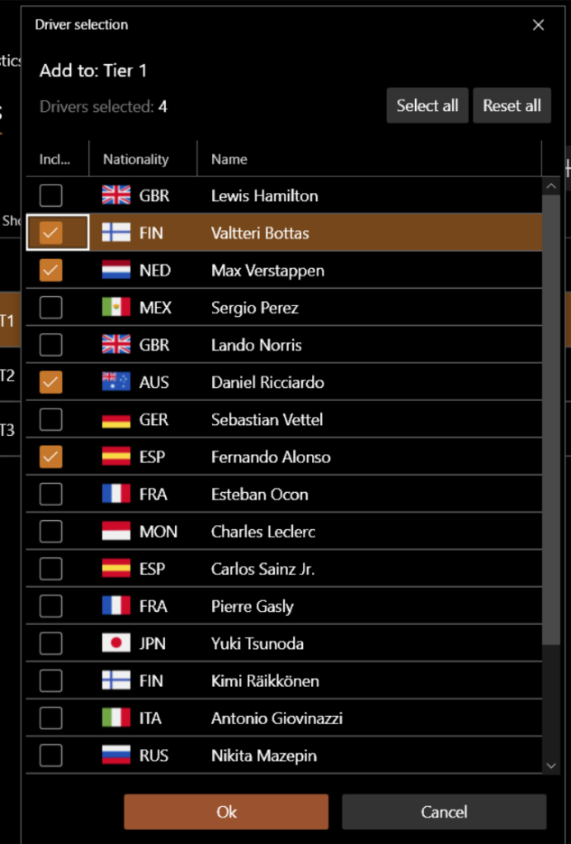

A season can have many different categories:

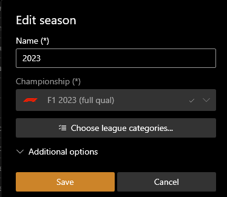

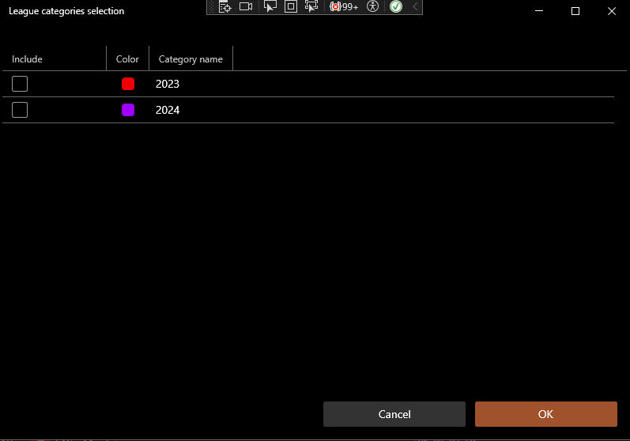

Categorization has the following advantages:

- Visually separate the seasons.
- Limiting the list of drivers in the session results tab.
- Better driver matching for live sessions.
- Filtering on the drivers page:

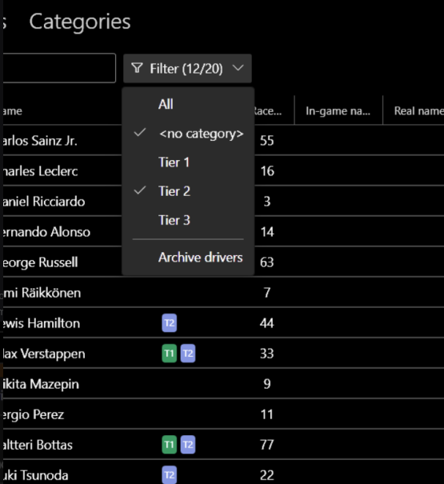

## Driver delete

You will not be able to delete a driver if they are present anywhere in the session results. This is normal and correct.
To simply remove the driver from all lists, just move them to the archive:

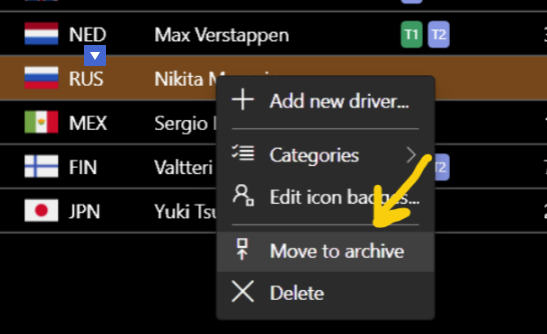

Later on you can do the reverse procedure, if necessary.

## Drivers management

If you use the live timing feature, it is a good idea to set up race numbers in advance for better driver matching:

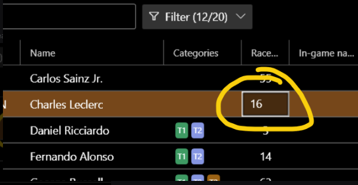

You can link badges next to the driver's name to display on renders:

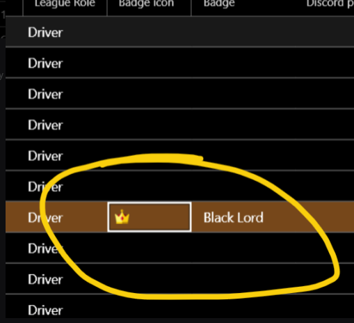

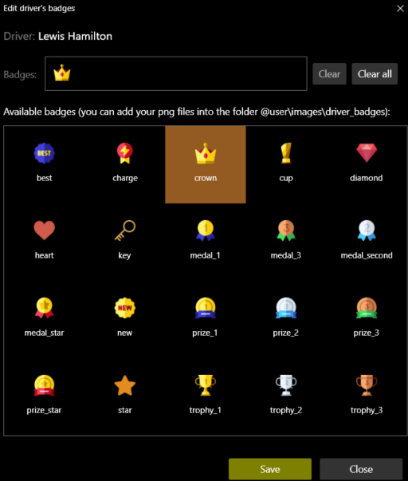

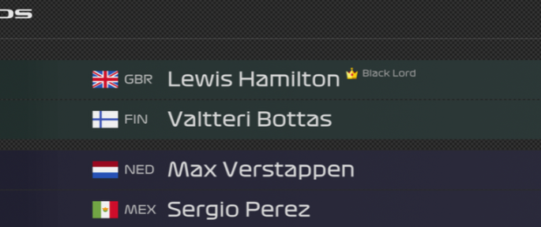

## Export / Import drivers

You can also export and import drivers from one database to another:

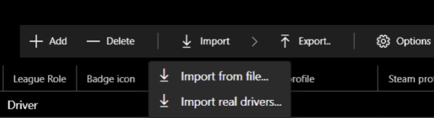

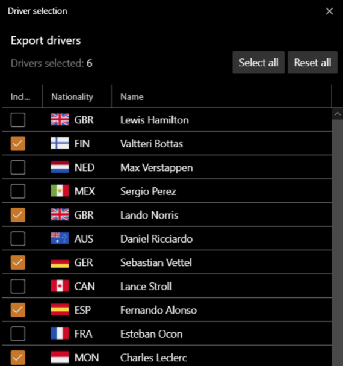

## Line-ups

Import and export also applies to line-ups:

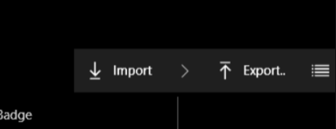
