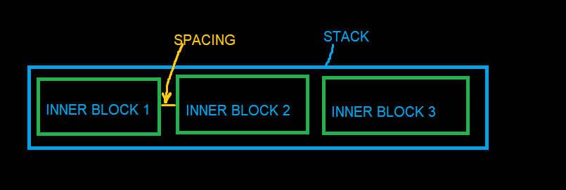
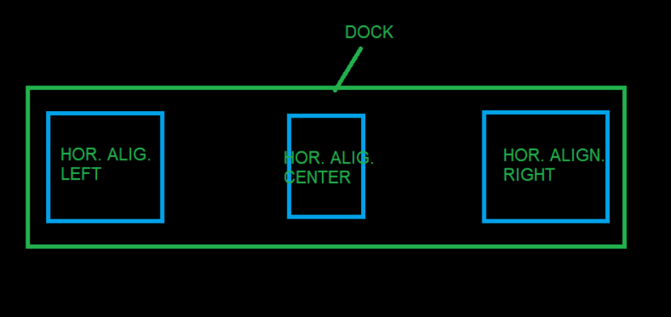
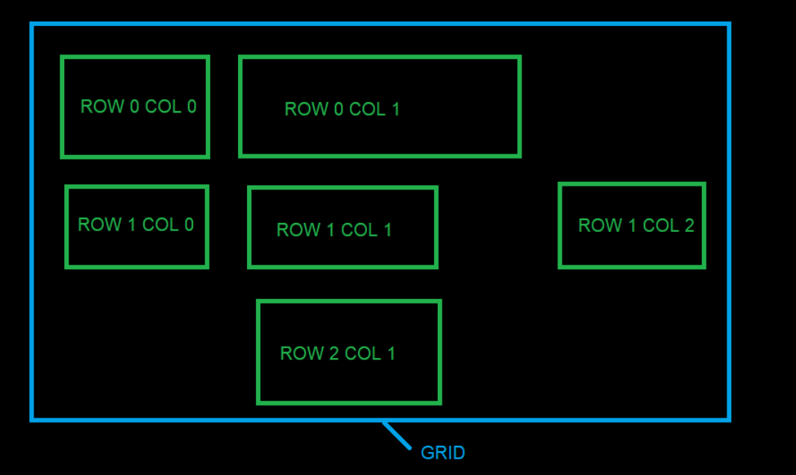
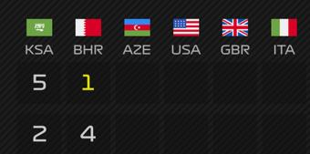

# Block Types and Block Options

Individual properties required for a specific type of block are placed in separate objects called **Block Options** (e.g., `ImageOptions`). It is not always necessary to specify this object if default values are sufficient.

The following sections describe properties for specific block options.

## Image

**BlockType:** `image`
**BlockOptions:** `ImageOptions`

Used to display an image.

| Property | Type | Description |
| --- | --- | --- |
| `Path` | `string` | Specifies the data object or path to the image file (`.png`, `.jpg`, `.jpeg`). |
| `DefaultPath` | `string` | Used if retrieving an image from `Path` fails. |
| `HorizontalAlignment` | `enum` | Options: `Left`, `Center`, `Right`. |
| `VerticalAlignment` | `enum` | Options: `Top`, `Center`, `Bottom`. |
| `Opacity` | `int` | Opacity level. |
| `Rotation` | `int` | Rotates the image clockwise around its center. Supports values beyond -360/360. |
| `RotateAroundCenter` | `bool` | If true, rotates the image around its center. Defaults to false. |

### Path Specification

The `Path` property (or `Source` property of the block) can be specified as:


**Relative path**: e.g., `separators/separator_red.png`. Specifies the full path relative to the `images` folder in the theme root (or layout/layer).


## Text

**BlockType:** `text`
**BlockOptions:** `TextOptions`

Used to display text.

| Property | Type | Description |
| --- | --- | --- |
| `Text` | `string` | The text content to display. |
| `FontName` | `string` | Font family. Defaults to global variable `FontNameDefault` if empty. |
| `FontSize` | `int` | Font size. Defaults to global variable `FontSizeDefault` if empty. |
| `FontStyle` | `enum` | Options: `Regular`, `Bold`, `Italic`, `BoldItalic`. (Experimental). |
| `Foreground` | `color` | Text color. Defaults to global variable `ForegroundDefault` if empty. |
| `TextAlignment` | `enum` | Options: `Start`, `End`, `Center`. (Experimental). |
| `HorizontalAlignment` | `enum` | Options: `Left`, `Center`, `Right`. |
| `VerticalAlignment` | `enum` | Options: `Top`, `Center`, `Bottom`. |
| `LineSpacing` | `int` | Spacing between lines. |
| `Wrap` | `bool` | Enables text wrapping. (Experimental). To make the text wrap, it may need to force the width of the text block. Dev in progress. |
| `Rotation` | `int` | Rotates text clockwise around its center. |
| `RotateAroundCenter` | `bool` | If true, rotates the text around its center. Defaults to false. |
| `ColorizeRating` | `ColorizeRatingOptions` | Sets foreground color based on rating value. |


### ColorizeRatingOptions

| Property | Type | Description |
| --- | --- | --- |
| `IsEnabled` | `bool` | Enables or disables the block. |
| `Level` | `int` | Value (0-100) determining the color. |
| `GradientStops` | `List<GradientStop>` | List of gradient stops for custom color assignment. If not specified, default values are used. |

### GradientStop

| Property | Type | Description |
| --- | --- | --- |
| `Color` | `color` | Specific color override. |
| `Offset` | `int` | Offset value (0-100). |

## Stack and Dock

**BlockTypes:** `stack`, `dock`
**BlockOptions:** `PanelOptions`

Container blocks that arrange nested blocks.

### Stack

Arranges nested (inner) blocks sequentially.



### Dock

Similar to Stack, with the following differences:

-   By default, it fills all available space (`StretchWidth` or `StretchHeight` is true, depending on `Orientation`).
-   If inner blocks specify alignment, Dock uses this to dock them to the sides.
-   Only one inner block can specify center alignment.



### PanelOptions Properties

| Property | Type | Description |
| --- | --- | --- |
| `Orientation` | `enum` | Options: `Horizontal`, `Vertical`. |
| `HorizontalDirection` | `enum` | Options: `LeftToRight`, `RightToLeft`. |
| `VerticalDirection` | `enum` | Options: `TopToBottom`, `BottomToTop`. |
| `Spacing` | `int` | Spacing in pixels between inner blocks. |

## ItemStack

**BlockType:** `itemstack`
**BlockOptions:** `ItemStackOptions`, `PanelOptions`

Similar to Stack, but inner blocks are generated automatically based on a data collection. The `Items` property is ignored.

Blocks within the `ItemTemplate` have access to the `Item` and `ItemIndex` expressions. If the `ItemStack` is nested within another iteration, they also have access to `ParentItem` and `ParentItemIndex`.

| Property | Type | Description |
| --- | --- | --- |
| `ItemSource` | `string` | Data access expression for the collection/list. |
| `ItemTemplate` | `block` | Template for inner blocks. |
| `SortMember` | `string` | Property name for sorting the collection. Can be data access expression. |
| `OrderBy` | `string` | Property name for sorting (supports `OrderBy2`, `OrderBy3`). |
| `OrderByDescending` | `string` | Property name for descending sort (supports `OrderByDescending2`, `3`). |
| `FilterMember` | `string` | Property name for filtering the collection. Can be data access expression. |
| `FilterMemberValue` | `string` | Value to filter by. |
| `Reverse` | `bool` | Reverses the collection order. |
| `Limit` | `int` | Limits the number of items. |
| `IndexStart` | `int` | Starting index of the collection. |
| `IndexEnd` | `int` | Ending index of the collection. |
| `TakeItemIndex` | `int` | Selects a single item by index (will be consist only of one item by specified index). |
| `TakeItemsFirst` | `int` | Selects the first N items. |
| `TakeItemsLast` | `int` | Selects the last N items. |
| `CollectionPart` | `string` | Specifies a part of the collection (e.g., "1/3" for the first third). |

## Grid

**BlockType:** `grid`
**BlockOptions:** `GridOptions`

Container for arranging inner blocks in a grid.



The Grid calculates column widths and row heights based on inner block dimensions. Use `GridCol` and `GridRow` properties on inner blocks to place them. Only one block per cell.

| Property | Type | Description |
| --- | --- | --- |
| `Rows` | `List<GridRowDefinition>` | Definitions for grid rows. |
| `Cols` | `List<GridColDefinition>` | Definitions for grid columns. |

### GridRowDefinition

| Property | Type | Description |
| --- | --- | --- |
| `Height` | `int` | Height of the row. |
| `IsStretchHeight` | `bool` | If true, fills available vertical space (only one row can be true). |

### GridColDefinition

| Property | Type | Description |
| --- | --- | --- |
| `Width` | `int` | Width of the column. |
| `IsStretchWidth` | `bool` | If true, fills available horizontal space (only one column can be true). |

## Canvas

**BlockType:** `canvas`
**BlockOptions:** `CanvasOptions`

A container that arranges inner blocks manually. Each inner block must define `PositionX` and `PositionY` to indicate its top-left coordinate, or `PlotPosition` to sit at a data point of a chart (see [Block](block.md)). `CanvasOptions` currently contains no properties.

A canvas also accepts `ItemStackOptions` (same properties as `ItemStack`). The `ItemTemplate` is then repeated for every item of the collection, and all copies are drawn at the same place, one over another. This is how one chart line per driver is drawn on a single chart. Static `Items` are drawn first, the generated copies on top. Added in 0.9.9.

## Table

**BlockType:** `table`
**BlockOptions:** `TableOptions`

Generates blocks as a table based on a collection/list. The `Items` property is not used.

Blocks within column templates have access to the `Item`, `ItemIndex`, and `ColumnIndex` expressions. If the `Table` is nested within another iteration, they also have access to `ParentItem` and `ParentItemIndex`.

| Property | Type | Description |
| --- | --- | --- |
| `ItemsSource` | `string` | Data access expression for the collection/list. |
| `HeaderTemplate` | `block` | Template for table headers. |
| `HeaderHeight` | `int` | Height of the header row. |
| `RowHeight` | `int` | Height of data rows. |
| `RowCount` | `int` | Number of rows. |
| `ColSpacing` | `int` | Spacing between columns. |
| `RowSpacing` | `int` | Spacing between rows. |
| `SeparatorSpace` | `int` | Additional space if a column is a separator. |
| `GroupSpaceReduction` | `int` | Space reduction between columns with the same `GroupId`. |
| `Columns` | `List<TableColumnDefinition>` | Definitions for table columns. |

*Note: Sorting and filtering properties (`SortMember`, `FilterMember`, etc.) are identical to `ItemStack`.*

### TableColumnDefinition

| Property | Type | Description |
| --- | --- | --- |
| `Width` | `int` | Width of the column. |
| `MarginLeft` | `int` | Left margin. |
| `MarginRight` | `int` | Right margin. |
| `IsStretchWidth` | `bool` | If true, fills available horizontal space. |
| `Header` | `string` | Text for the header template (will be replace text property of any text block of header template). |
| `RenderIf` | `bool` | Conditional rendering flag. |
| `Template` | `block` | Template for each item in the column. |
| `IsSeparator` | `bool` | Indicates if the column is a separator. |
| `GroupId` | `int` | Groups columns to adjust spacing (same group Id (>0) can be set for several column to bring them closer to each other in the column space). |
| `MultiColumnHeadersSource` | `string` | Data expression (only for collection/list) for multicolumn headers. |
| `MultiColumnItemsSource` | `string` | Data expression (only for collection/list) for multicolumn items. |
| `MultiColumnHeaderTemplate` | `block` | Template for multicolumn items. |
| `MultiColumnLimit` | `int` | Maximum number of items to display in multicolumn. |
| `MultiColumnIndexStart` | `int` | Start index for multicolumn items. |
| `MultiColumnIndexEnd` | `int` | End index for multicolumn items. |

### Multicolumn

A feature for expanding one column into multiple columns.



## Shape

**BlockType:** `shape`
**BlockOptions:** `ShapeOptions`

Displays a simple geometric figure, a line, or a chart line built from data.

| Property | Type | Description |
| --- | --- | --- |
| `ShapeType` | `enum` | Options: `rectangle`, `ellipse`, `line`, `polyline`. `line` and `polyline` added in 0.9.9. |
| `Fill` | `color` | Fill color of `rectangle` and `ellipse`. |
| `Rotation` | `int` | Rotates the shape clockwise around its center. |
| `RotateAroundCenter` | `bool` | If true, rotates the shape around its center. Defaults to false. |
| `Stroke` | `StrokeOptions` | Outline of `rectangle` and `ellipse`, the line itself for `line` and `polyline`. Added in 0.9.9. |
| `X1`, `Y1`, `X2`, `Y2` | `number` | `line`: start and end point, in pixels of the block or in data units when `Scale` is set.<br>`rectangle` and `ellipse` with `Scale`: the data range the shape covers (bars, bands). Nothing is drawn when a value is missing. Added in 0.9.9. |
| `GapX`, `GapY` | `number` | `rectangle` and `ellipse` with `Scale`: pixels left empty between neighbouring bars. The shape shrinks by half of the gap on each side. Added in 0.9.9. |
| `Points` | `string` | `polyline`: data access expression for the collection of points, for example `{Item.LapPositions}`. Added in 0.9.9. |
| `PointX` | `string` | `polyline`: point property holding X. Defaults to `X`. The item index is used when the value is missing. Added in 0.9.9. |
| `PointY` | `string` | `polyline`: point property holding Y. Defaults to `Y`. An empty value is a missing point. Added in 0.9.9. |
| `MissingData` | `enum` | `polyline`: `break` (default) splits the line at a missing point, `connect` joins its neighbours. Added in 0.9.9. |
| `Smoothing` | `enum` | `polyline`: `none` (default) or `curve` (smooth curve through every point). Added in 0.9.9. |
| `Markers` | `MarkerOptions` | `polyline`: marks drawn on every point. Added in 0.9.9. |
| `Scale` | `ScaleOptions` | Maps data values onto the block. Without it `line` uses pixels and `polyline` fits its own data. Added in 0.9.9. |

### StrokeOptions

| Property | Type | Description |
| --- | --- | --- |
| `Color` | `color` | Line color. Defaults to white. |
| `Thickness` | `number` | Line thickness in pixels. Defaults to `1`. |
| `Opacity` | `number` | `0` to `1`, multiplied with the color alpha. Defaults to `1`. |
| `DashStyle` | `enum` | `solid` (default), `dash`, `dot`, `dashdot`, `dashdotdot`. |
| `DashPattern` | `string` | Custom dash pattern in line thicknesses, for example `"6,2,1,2"`. Overrides `DashStyle`. |
| `LineCap` | `enum` | Line ends: `butt` (default), `round`, `square`. |
| `LineJoin` | `enum` | Line corners: `miter` (default), `round`, `bevel`. |

### ScaleOptions

The plotted area is the block minus `Inset` on every side. A data value is placed proportionally between the minimum and the maximum.

| Property | Type | Description |
| --- | --- | --- |
| `XMin`, `XMax` | `number` | X range. Defaults to the range of the data of the shape. |
| `YMin`, `YMax` | `number` | Y range. Defaults to the range of the data of the shape. |
| `InvertY` | `bool` | If true, the smallest Y is at the top (for example position 1 on a lap chart). Defaults to false: the smallest Y is at the bottom. |
| `Inset` | `number` | Pixels between the block edge and the plotted area. Defaults to half the stroke plus the marker size for lines, `0` for bars and `PlotPosition`. Set the same value on stacked chart layers so that their scales line up. |
| `BandX`, `BandY` | `bool` | Category axis: every whole value from min to max gets its own slot. Points and labels sit in the slot center. A bar with `X1` = `X2` = `i` fills slot `i`. |

### MarkerOptions

| Property | Type | Description |
| --- | --- | --- |
| `Shape` | `enum` | `ellipse` (default) or `rectangle`. |
| `Size` | `number` | Marker size in pixels. Defaults to `6`. |
| `Fill` | `color` | Marker fill. Defaults to the line color. |
| `Stroke` | `StrokeOptions` | Marker outline. |

### Charts

A chart is a `canvas` with several layers of the same size. Shapes with the same `Width`, `Height` and `Scale` are drawn over each other, so their data coordinates match. Labels use `PlotPosition` with the same scale and area size. The default theme layout `session_results_race_lapchart` is a complete example.

A position chart, one line per driver in the team color:

```json
{
  "BlockType": "canvas",
  "ItemStackOptions": {
    "ItemSource": "{Session.Drivers}",
    "Reverse": true,
    "ItemTemplate": {
      "BlockType": "shape",
      "Width": 1400,
      "Height": 720,
      "ShapeOptions": {
        "ShapeType": "polyline",
        "Points": "{Item.LapPositions}",
        "PointX": "Lap",
        "PointY": "Position",
        "Scale": { "XMin": 0, "XMax": "{Session.LeaderLapsCount}", "YMin": 1, "YMax": "{Session.DriversCount}", "InvertY": true, "Inset": 18 },
        "Stroke": { "Color": "{Item.Team.Color}", "Thickness": 4, "LineJoin": "round" }
      }
    }
  }
}
```

A bar chart of race points with a value label above each bar:

```json
{
  "BlockType": "canvas",
  "ItemStackOptions": {
    "ItemSource": "{Session.Drivers}",
    "ItemTemplate": {
      "BlockType": "canvas",
      "Items": [
        {
          "BlockType": "shape",
          "Width": 900,
          "Height": 200,
          "ShapeOptions": {
            "ShapeType": "rectangle",
            "X1": "{ItemIndex}",
            "X2": "{ItemIndex}",
            "Y1": 0,
            "Y2": "{Item.DriverPoints.FloatValue}",
            "GapX": 8,
            "Fill": "{Item.Team.Color}",
            "Scale": { "XMin": 0, "XMax": "{Session.DriversCount, Converter=NumberSubtract, Parameter=1}", "YMin": 0, "YMax": 30, "BandX": true }
          }
        },
        {
          "BlockType": "text",
          "Source": "{Item.DriverPoints.Value}",
          "PlotPosition": {
            "X": "{ItemIndex}",
            "Y": "{Item.DriverPoints.FloatValue}",
            "AreaWidth": 900,
            "AreaHeight": 200,
            "AnchorY": "Bottom",
            "OffsetY": -4,
            "Scale": { "XMin": 0, "XMax": "{Session.DriversCount, Converter=NumberSubtract, Parameter=1}", "YMin": 0, "YMax": 30, "BandX": true }
          }
        }
      ]
    }
  }
}
```

## Component

**BlockType:** `component`
**BlockOptions:** `ComponentOptions`

Used to reuse complex blocks across different places in a layer or layout.

| Property | Type | Description |
| --- | --- | --- |
| `Vars` | `Dictionary<string, object>` | Variables passed to the component. |

## ColorizeOptions

**BlockOptions:** `ColorizeOptions`

Describes how the background or final image of a block should be colored or masked.

| Property | Type | Description |
| --- | --- | --- |
| `Enabled` | `bool` | Enables colorization. |
| `Color` | `color` | Target color (used if `ColorImage` is not specified). |
| `ColorImage` | `string` | Relative path to a PNG image to be used as a color overlay or a layer mask. |
| `ColorImageMode` | `enum` | How the `ColorImage` is applied. Options: `Alpha` (draws image over source), `Luminance` (uses image as a Photoshop-like layer mask). Default: `Luminance`. |
| `BlendPercentage` | `int` | Intensity of the effect (0-100). For `Luminance` masks, it controls how much the mask affects the original alpha. |
| `AlphaCompositionMode` | `enum` | Composition mode. Possible values: `SrcOver`, `Src`, `SrcAtop`, `SrcIn`, `SrcOut`, `Dest`, `DestAtop`, `DestOver`, `DestIn`, `DestOut`, `Clear`, `Xor`. Default: `SrcAtop`. |
| `ColorBlendingMode` | `enum` | Blending mode. Possible values: `Normal`, `Multiply`, `Add`, `Subtract`, `Screen`, `Darken`, `Lighten`, `Overlay`, `HardLight`. Default: `Screen`. |

### Layer Mask Behavior (Luminance Mode)

When `ColorImageMode` is set to `Luminance`, the `ColorImage` acts as a **Layer Mask**:
- The mask is automatically resized to match the source block dimensions.
- **Transparent areas** in the mask are treated as black (fully transparent for the source).
- **Bright/White areas** in the mask keep the source image opaque.
- **Dark/Black areas** in the mask make the source image transparent.
- The mask uses both the RGB luminance and the Alpha channel of the `ColorImage` to determine the final transparency, allowing for smooth gradients even with transparent PNGs.
