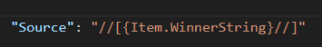

# Expressions

Expressions allow access to data and variables. Most properties, including enumerations like `HorizontalAlignment`, support expressions.

An expression is a string enclosed in curly braces: `"{expression}"`.


## Data Sources

Expressions can retrieve data from the following sources:

- Data objects (see [Data Objects](#data-objects)).
- Variables (see [Variables](variables.md)).
- Public properties (see [Public Properties](public-properties.md)).
- Localization variables (see [Localization Support](localization-support.md)).
- Current block context (`Item`, `ItemIndex`, `ColumnIndex`).

## Data Objects

Data objects are described in the Data Objects API (see [Appendix](appendix.md)).

Each render type provides a specific set of root data objects:

- **RaceResults, QualResults, CombinedQualResults**: `Session`, `Event`
- **DriverStandings, TeamStandings**: `Standings`
- **Lineups, LineupsReserve**: `Lineups`
- **Calendar**: `Events`
- **DriverSessionStatistics**: `Statistics`, `Session`, `Event`
- **DriverSeasonStatistics**: `Statistics`
- **DriverSession**: `DriverInfo`, `Session`, `Event`
- **DriverInfo**: `DriverInfo`
- **PenaltyItem**: `Penalty`
- **PenaltyItems**: `Penalties`
- **PenaltySeasonStatistics**: `Penalties`

### Mapping Root Objects to API Classes

| Root Data Object | API Class |
| --- | --- |
| `LayoutInfo` | `LayoutInfo` |
| `Season` | `SeasonRenderData` |
| `Session` | `SessionRenderData` |
| `Standings` | `StandingsSeasonRenderData` |
| `Events` | `EventsSeasonRenderData` |
| `Event` | `EventRenderData` |
| `Lineups` | `LineupsSeasonRenderData` |
| `Statistics` | `StatisticsRenderHost` |
| `DriverInfo` (DriverSession) | `DriverSessionRenderHost` |
| `DriverInfo` (DriverInfo) | `DriverRenderHost` |
| `Penalty` | `PenaltyItemRenderData` |
| `Penalties` (PenaltyItems) | `EventPenaltiesRenderHost` |
| `Penalties` (PenaltySeasonStatistics) | `SeasonPenaltiesRenderHost` |

The `LayoutInfo` and `Season` data objects are available in all render types.

Some render objects contain `Name` and `LogoPath` properties (which can be null) if the corresponding class inherits from `NamedRenderData`.

Access properties using the full path:

```text
{Session.DriverDayDriver.Name}
```

If the expression does not contain a dot, the application searches for a variable with that name.

For inner blocks within collections (e.g., `ItemStack`, `Table`), the following root objects are available:

- `Item`: Access to the current item in the collection.
- `ItemIndex`: Index of the current item (integer, starts at 0).
- `ColumnIndex`: Index of the current column (integer, starts at 0, only for tables).

Complex or mismatched types are converted to strings. Objects of type `byte[]` can be referenced as image paths for database-stored images.

Example expression:


## Return Values

Depending on the context, an expression returns either an object (e.g., `bool`, `number`, `color`) or a string. If the context requires a string but the expression returns an object, the object is forced to a string.

If a block property requires a specific object type (e.g., `PaddingLeft` requires a number), only one expression can be used at the root.

**Correct:**


**Incorrect:**


If the property requires a string, expressions can be combined freely.

## Combining Expressions

Expressions can be nested, and an expression can be used as a converter name or parameter. The nesting depth is unlimited. This also applies to localization string substitutions.


For string properties, multiple expressions can be combined with literals in a single string:


## Escaping Special Symbols

To use special characters as literals instead of control characters, escape them using a double forward slash `//`.

| Symbol | Escape Sequence | Context |
| --- | --- | --- |
| `{` | `//{` | General |
| `}` | `//}` | General |
| `[` | `//[` | General |
| `]` | `//]` | General |
| `<` | `//<` | General |
| `>` | `//>` | General |
| `=` | `//=` | Inside expression |
| `:` | `//:` | Inside converter parameters |
| `;` | `//;` | Inside converter parameters |

Example:



This expression converts to:

```text
[driver_name]
```

> **Note**: Forward slashes are used instead of backslashes to avoid issues with JSON parsers. Double slashes are used to prevent conflicts with URIs and file paths.
