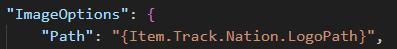
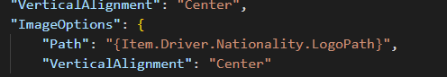
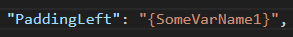
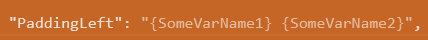
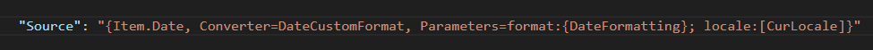
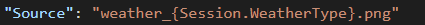
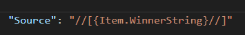

# Expressions

Expressions allow access to data and variables. Most properties, including enumerations like `HorizontalAlignment`, support expressions.

An expression is a string enclosed in curly braces: `"{expression}"`.



## Data Sources

Expressions can retrieve data from the following sources:

- Data objects (see [Data Objects](data-objects.md)).
- Variables (see [Variables](variables.md)).
- Public properties (see [Public Properties](public-properties.md)).
- Localization variables (see [Localization Support](localization-support.md)).
- Current block context (`Item`, `ItemIndex`, `ColumnIndex`).

## Accessing Data

The full list of available root data objects and their mapping to API classes is described in [Data Objects](data-objects.md).

Access properties using the full path:

```text
{Session.DriverDayDriver.Name}
```

If the expression does not contain a dot, the application searches for a variable with that name.

### Collection Context

For inner blocks within collections (e.g., `ItemStack`, `Table`), the following root objects are available:

- `Item`: Access to the current item in the collection.
- `ItemIndex`: Index of the current item (integer, starts at 0).
- `ColumnIndex`: Index of the current column (integer, starts at 0, only for tables).

Example expression:



## Return Values

Depending on the context, an expression returns either an object (e.g., `bool`, `number`, `color`) or a string. If the context requires a string but the expression returns an object, the object is forced to a string.

If a block property requires a specific object type (e.g., `PaddingLeft` requires a number), only one expression can be used at the root.

**Correct:**



**Incorrect:**



If the property requires a string, expressions can be combined freely.

## Combining Expressions

Expressions can be nested, and an expression can be used as a converter name or parameter. The nesting depth is unlimited. This also applies to localization string substitutions.



For string properties, multiple expressions can be combined with literals in a single string:



## Escaping Special Symbols

To use special characters as literals instead of control characters, escape them using a double forward slash `//`.

| Symbol | Escape Sequence | Context |
| --- | --- | --- |
| `{` | `//{` | General |
| `}` | `//}` | General |
| `[` | `//[` | General |
| `]` | `//]` | General |
| `<` | `//<` | General |
| `>` | `//>` | General |
| `=` | `//=` | Inside expression |
| `:` | `//:` | Inside converter parameters |
| `;` | `//;` | Inside converter parameters |

Example:



This expression converts to:

```text
[driver_name]
```

> **Note**: Forward slashes are used instead of backslashes to avoid issues with JSON parsers. Double slashes are used to prevent conflicts with URIs and file paths.
