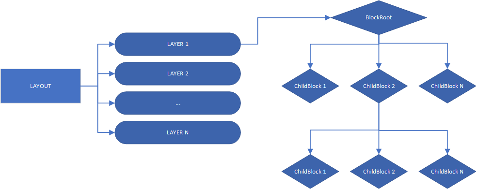

# Introduction

Racing League Tools (RLT) implements advanced 2d graphics renderer. The renderer reads easy-to-edit JSON files to decide what image should generate. The format is intentionally simple and easy to edit.

It uses a special language for describing markup, fundamentally similar to the various XML
languages, especially close to XAML. However, currently only JSON format is supported.

## Themes

A theme is a single folder that contains all files the renderer needs to build images: layouts (JSON), assets (images, fonts), styles (JSON), and optional components.

The app includes a default theme. Only one theme is active at a time. If a resource is missing in the active theme, the renderer falls back to the default theme.

It recommend to use Visual Studio Code for editing JSON files. The RLT Theme Helper extension (made by Kaac) adds snippets and validation and greatly speeds up theme editing:
[RLT Theme Helper — VS Code Marketplace](https://marketplace.visualstudio.com/items?itemName=Kaaac.rlt-theme-helper)

Renderer supports comments in JSON files ( // single-line ). These comments are not part of the official JSON specification and may be rejected by standard JSON parsers or validators — However, this was done for convenience.

To create a new theme use main menu -> “Renderer themes” -> “Create new theme”:

## Basic Principles

A theme is a collection of **layouts**. Each layout generates a finished final image.  
Layout, in turn, is a collection of **layers**. Each layer also generates an image, but they are *overlapped* to produce
the final image. Any layout must have at least 1 layer.

A **layer** is a hierarchical structure of **blocks**. Each block is a graphic primitive (*text*, *image*,
*container* for other blocks).  
Any layer starts with **BlockRoot**, it's actually a regular block, but it's at the root of the composition. Typically, **BlockRoot** is a *container*, which allows to have a
complex composition of blocks in a layer.

*In another words:*

- **Layout**  
  Produces one final image.  
  Must contain at least one layer.

- **Layer**  
  Renders an intermediate image.  
  Layers are stacked in order (background → content → possible overlays).  
  Made of blocks arranged in a hierarchy.

- **Block**  
  A graphic primitive: **TextBlock**, **ImageBlock**, or a **Container** that holds other blocks.

- **BlockRoot**  
  The top-level block of a layer (usually a container).  
  Defines common positioning, padding, and transformations for the whole layer.