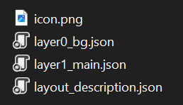

# Layouts

Every theme is a collection of layouts, where each layout defines how the final image is rendered.

## Layout Folder Structure

Layout folders live in `%theme_folder%/layouts/`. Each layout has its own folder, and folder names can be customized:


A layout folder can include:

- `layout_description.json` (required) - metadata for the layout.
- Layer folders or layer files (custom names) - content of each layer.
- `images/` (optional) - shared layout assets.
- `vars/` (optional) - layout-specific variables.
- `components/` (optional) - reusable building blocks.
- `styles/` (optional) - style overrides.
- `triggers/` (optional) - trigger definitions.
- `icon.png` (optional) - icon shown next to the layout title in the app UI.

Themes can be combined. If the active theme set does not contain a required layout, the renderer falls back to the next theme in the priority list and eventually to the default theme.

## Layout Icons

A layout can override the default icon displayed in the app UI:


Place an `icon.png` file inside the layout folder to provide the custom icon:



## layout_description.json

`layout_description.json` describes how the layout appears and which data it receives.

| Property | Type | Required | Description |
| --- | --- | --- | --- |
| `LayoutName` | string | No | Friendly name shown in tooling (optional). |
| `RenderType` | enum | Yes | Determines the data context passed to the layout. See [Render types](#render-types). |
| `RenderDataType` | enum | No | Narrows the data to a specific variant for the chosen `RenderType`. |
| `RenderVersion` | int | No | Controls ordering when multiple layouts share the same `RenderType` and `RenderDataType`. Default is `1`. |
| `RenderCaption` | string | No | Caption shown in the UI. When it starts with a lowercase letter, the prefix `Render ` is added automatically. |
| `RenderCaptions` | dictionary `<string, object>` | No | Context-specific captions keyed by usage scenario. See [Render captions](#render-captions). |
| `IsShowsAsSegmentQual` | bool | No | For `QualResults` only: controls whether the layout is available for qualification segments (Q1, Q2, Q3). Default is `true`. |

Basic layouts such as race and qualification results typically use `RenderVersion = 1`, but it can be overridden.

## Render types

Render types define which root data objects are passed to layout layers and how the layout is exposed to end users.

| RenderType | Root data objects | Necessary render versions | Maximum render versions | Default caption |
| --- | --- | --- | --- | --- |
| `RaceResults` | Session, Event | 1 | 5 | "Render results" |
| `QualResults` | Session, Event | 1 | 5 | "Render results" |
| `CombinedQualResults` | Session, Event | 1 | 5 | "Render combined results" |
| `DriverStandings` | Standings | 3 | 5 | "Render driver standings" |
| `TeamStandings` | Standings | 1 | 5 | "Render team standings" |
| `Lineups` | Lineups | 2 | 5 | "Render lineups" |
| `Calendar` | Events | 1 | 5 | "Render calendar" |
| `DriverSessionStatistics` | Statistics, Session, Event | see below | see below | varies by `RenderDataType` |
| `DriverSeasonStatistics` | Statistics | see below | see below | varies by `RenderDataType` |
| `DriverSession` | DriverInfo, Session, Event | 1 | 3 | "Render driver session" |
| `DriverInfo` | DriverInfo | 1 | 3 | "Render driver info" |
| `PenaltySeasonStatistics` | Penalties | 1 | 3 | "Render season's penalty statistics" |
| `PenaltyItem` | Penalty | 1 | 3 | "Render penalty" |
| `PenaltyItems` | Penalties | 1 | 3 | "Render penalties" |

- Root data objects are described in [Expressions](./expressions.md).
- Maximum render versions is the number of layouts with the same render type that can appear in the UI.
- Necessary render versions is the minimum expected count before falling back to layouts from other themes. For example, `DriverStandings` expects three variations (regular, season progress by points, season progress by position). Missing versions are taken from the default theme.
- When `RenderVersion` is greater than `1`, the version number is appended to the caption (for example, `Render results (2)`).

## Render captions

Some layouts are used in the app in different places and with different contexts. For example, a layout `PenaltyItems` is used as a layout for rendering all penalties of all sessions of a *specific event*, as well as only *the last event*, or as a layout for rendering only *user-selected penalties*. In each case, a different menu item header should be applied. This is what `RenderCaptions` property can be used for.

| RenderType | Default caption | Specific render captions |
| --- | --- | --- |
| `QualResults` | "Render results" | `QualSegment`: "Render segment" |
| `PenaltyItems` | "Render event's penalties" | `EventPenalties`: "Render event penalties"<br>`EventPenaltiesWithSelection`: "Render event penalties (with selection)..."<br>`LastEventPenalties`: "Render last event's penalties"<br>`LastEventPenaltiesWithSelection`: "Render last event's penalties (with selection)..." |

## Render data types

Some layouts using the same `RenderType` and `RenderVersion` may receive different data. The most obvious example is statistics: it may be different, but the layout architecture is similar for all types of statistics.

For example, the default theme defines only one layout of type `DriverSessionStatistics`, and with the help of variables and expressions allows to render different types of statistics.

However, if necessary, it is possible to create a layout that will be used to render only a specific type of data. And with `RenderVersion`, there can be several kinds of such layouts. It is for this purpose that the `RenderDataType` property is used:

```json
{
  "RenderType": "DriverSessionStatistics",
  "RenderDataType": "AttackRating"
}
```

If `RenderDataType` is not defined in `layout_description.json`, this layout will be used by default for all data types.

### RenderType: DriverSessionStatistics

| RenderDataType | Maximum render versions | Necessary render versions | Default caption |
| --- | --- | --- | --- |
| `PureRacePaceRating` | 2 | 1 | "Render pure race pace" |
| `ConsistancyRating` | 2 | 1 | "Render consistency rating" |
| `FastestLaps` | 2 | 1 | "Render fastest laps" |
| `LongestStints` | 2 | 1 | "Render longest stints" |
| `AttackRating` | 2 | 1 | "Render attack rating" |
| `DefenseRating` | 2 | 1 | "Render defense rating" |
| `TopBattles` | 1 | 1 | "Render top battles" |

### RenderType: DriverSeasonStatistics

| RenderDataType | Maximum render versions | Necessary render versions | Default caption |
| --- | --- | --- | --- |
| `AvgPoints` | 1 | 1 | "Render avg of points" |
| `AvgQualPos` | 1 | 1 | "Render avg of qualification position" |
| `AvgRacePos` | 1 | 1 | "Render avg of race position" |
| `FinishesBestSeries` | 1 | 1 | "Render finishes best series" |
| `FinishesPercent` | 1 | 1 | "Render finishes percent" |
| `GainedPositions` | 1 | 1 | "Render grid to finish position change" |
| `PenaltyPoints` | 1 | 1 | "Render penalty points" |
| `PenTimeAllAvg` | 1 | 1 | "avg sum of penalty times" |
| `PenTimeAllSum` | 1 | 1 | "sum of penalty times" |
| `PenTimeIngameAvg` | 1 | 1 | "avg of ingame penalty time" |
| `PenTimeIngameSum` | 1 | 1 | "sum of ingame penalty time" |
| `PenTimeStewardAvg` | 1 | 1 | "avg of steward's penalty time" |
| `PenTimeStewardSum` | 1 | 1 | "sum of steward's penalty time" |
| `PointsBestSeries` | 1 | 1 | "points best series" |
| `TotalTyresUsage` | 1 | 1 | "tyre compound usage" |
