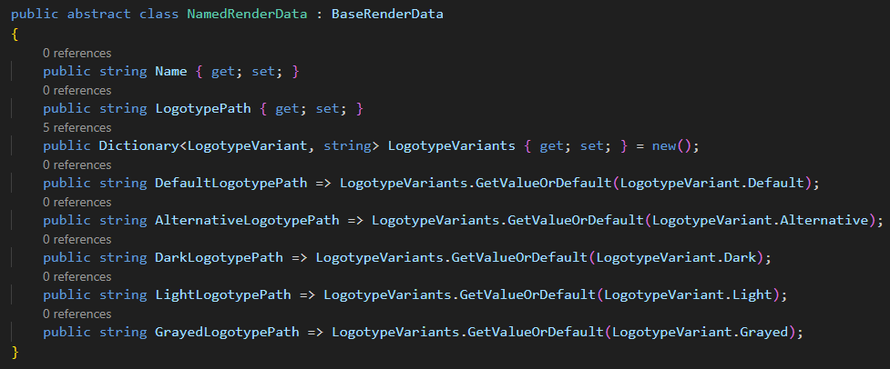
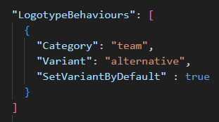

# Logotypes

Logotypes are images automatically associated with various database objects based on specific conventions.

## Object Categories and Paths

The following table lists the available categories, their corresponding renderer API objects, and the target folders where images are stored.

| Category | Object Type (Renderer API) | Target Folder |
| --- | --- | --- |
| Nation | `NationRenderData` | `images/flags` |
| Game | `GameRenderData` | `images/logotypes/games` |
| Vendor | `VendorRenderData` | `images/logotypes/vendors` |
| CarClass | `CarClassRenderData` | `images/logotypes/classes` |
| Car | `CarRenderData` | `images/logotypes/cars` |
| Team | `TeamRenderData` | `images/logotypes/teams` |
| Track | `TrackRenderData` | `images/logotypes/circuits` |
| Championship | `ChampionshipRenderData` | `images/logotypes/championships` |
| Season | `SeasonRenderData` | `images/logotypes/seasons` |
| Event | `EventRenderData` | `images/logotypes/events` |
| Driver | `DriverRenderData` | `images/driver_avatars` |

## Search Algorithm

When the application requires a logotype for a specific object, it uses a flexible algorithm to locate the file.

**Key Moments:**

- The object reports a list of file names. Any `.` character in the name can be replaced with `_` and the ` ` character with `_` (without mixing). For example, the object is a specific team: `Red Bull` (F1 2023 championship). This team has base name `Red Bull` and uniqueId: `red.bull.2023`. Such an object would require logos with a file name of either `red.bull.2023`, `red_bull_2023`, `red bull`, or `red_bull`. The more specific name (`red.bull.2023`) will have priority. Character case does not matter.
- Any invalid file system characters in the name are removed during the search.
- The search is performed recursively in the target folder and all subfolders. This means that the folder hierarchy can be as complex as needed.
- Duplicate filenames (regardless of extension) are not allowed within the same hierarchy.

**Search Order:**

The application searches for the logotype in the following order. The first match found is used.

1.  **User Folder:** `<app_root>/user/<target_folder>/`
2.  **Current Theme Folder:** `<app_root>/user/themes/<current_theme>/<target_folder>/`
    *   This allows themes to override default logotypes.
3.  **Default Folder:** `<app_root>/<target_folder>/`

For example, if the current theme folder contains `red bull.png` but not `red.bull.2023.png`, the application may fall back to the default folder depending on the configuration (it possible to use property `UseFallbackSource`).


Png and jpeg images are supported with extensions `.png`, `.jpg`, `.jpeg`.

## Logotype Variants

Objects may require different versions of a logo depending on the context (e.g., a dark logo for a light background).

**Available Variants:**

- `default`
- `alternative`
- `dark`
- `light`
- `grayed`

**Naming Convention:**

Variants are distinguished by a file suffix separated by two underscores (`__`).

Format: `{filename}__{appendix}.{extension}`

**Examples:**

- Default: `red_bull.png`
- Alternative: `red_bull__alternative.png`
- Dark: `red_bull__dark.png`

## Configuration

The search behavior is controlled via the `LogotypeBehaviours` property in the `theme_description.json` file.


### LogotypeBehaviour Object

| Property | Type | Required | Description |
| --- | --- | --- | --- |
| `Category` | `string` | Yes | The logotype category (see table above). |
| `Variant` | `enum` | No | The variant to configure (`default`, `alternative`, `dark`, `light`, `grayed`). Default is `default`. |
| `UseFallbackVariant` | `bool` | No | If `true`, searches for the default variant if the specified variant is missing. Default is `true`. |
| `UseFallbackSource` | `bool` | No | If `true`, searches the default folder if the logo is not found in the theme folder. Default is `true`. |
| `SetVariantByDefault` | `bool` | No | If `true`, this variant becomes the default for the object. Default is `false`. |

## Accessing Logotypes in Templates

To access a specific variant in the renderer, use the properties of the `NamedRenderObject` class (the base class for `TeamRenderData`, `DriverRenderData`, etc.).



**Example:**

To get the dark variant of a team logo:

```csharp
{Team.DarkLogotypePath}
```

## Optimization and Requirements

By default, the application does not search for or load variants other than the default one to save resources. The theme must explicitly declare which variants are required for each category.

This is defined using the `RequiredLogotypeVariants` property in `theme_description.json`. It is a dictionary where the key is the category and the value is a list of required variants.


### Default Variant Override

The `LogotypePath` property of a `NamedRenderObject` normally returns the `default` variant. A theme can override this by setting `SetVariantByDefault` to `true` in `LogotypeBehaviours`.

**Example:**

If `theme_description.json` contains the following configuration, `{Team.LogotypePath}` will return the path to the alternative logo.


