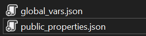

# Public Properties

Public properties allow end-users to modify the theme's behavior through a user-friendly UI. Each custom property becomes a variable with a name and a value.

To define public properties, create a `public_properties.json` file in the `%theme_folder%/globals/` directory.

## Configuration File Structure

The `public_properties.json` file consists of lists for properties, categories, and presets.

### Root Object

| Property | Type | Required | Description |
| --- | --- | --- | --- |
| `Properties` | `PublicProperty[]` | Yes | List of public properties. |
| `Categories` | `PublicPropertiesCategory[]` | No | List of property categories. |
| `Presets` | `PublicPropertiesPreset[]` | No | List of predefined property sets. |

### PublicProperty

| Property | Type | Required | Description |
| --- | --- | --- | --- |
| `Name` | `string` | Yes | Variable name. |
| `PublicName` | `string` | Yes | Name displayed in the UI. |
| `Type` | `enum` | Yes | Variable type: `Bool`, `Integer`, `String`, `Float`, `Enum`. |
| `DefaultValue` | `object` | No | Default value of the property. |
| `Description` | `string` | No | Description of the property. |
| `Category` | `string` | No | Category name the variable belongs to. |
| `MinimumValue` | `int` | No | Minimum value for `Integer` and `Float` types. |
| `MaximumValue` | `int` | No | Maximum value for `Integer` and `Float` types. |
| `EnumValues` | `string[]` | No | List of allowed values for `Enum` type. |

### PublicPropertiesCategory

| Property | Type | Required | Description |
| --- | --- | --- | --- |
| `Name` | `string` | Yes | Category name displayed in the UI, spaces are allowed |
| `Order` | `int` | No | Display order of the category. |

### PublicPropertiesPreset

| Property | Type | Required | Description |
| --- | --- | --- | --- |
| `Name` | `string` | Yes | Preset name displayed in the UI, spaces are allowed |
| `DefinedProperties` | `Dictionary<string, object>` | Yes | Key-value pairs of property names and their values. |

## Enum Properties

If users need to select a value from a predefined list, use the `Enum` type. The selected value is stored as a string.

## Categories

Categories group specific sets of properties. Use the `Category` property in the `PublicProperty` object to map a property to a category. Unmapped properties appear at the beginning of the list.

## Presets

Presets allow users to quickly define values for multiple properties at once. Add a preset to the `Presets` collection, specify a name, and set values using the `DefinedProperties` dictionary.

