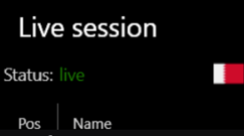
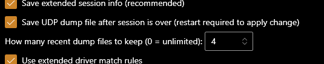
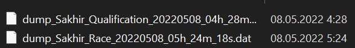
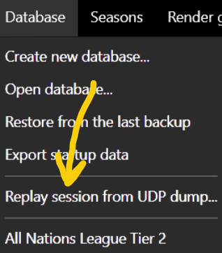
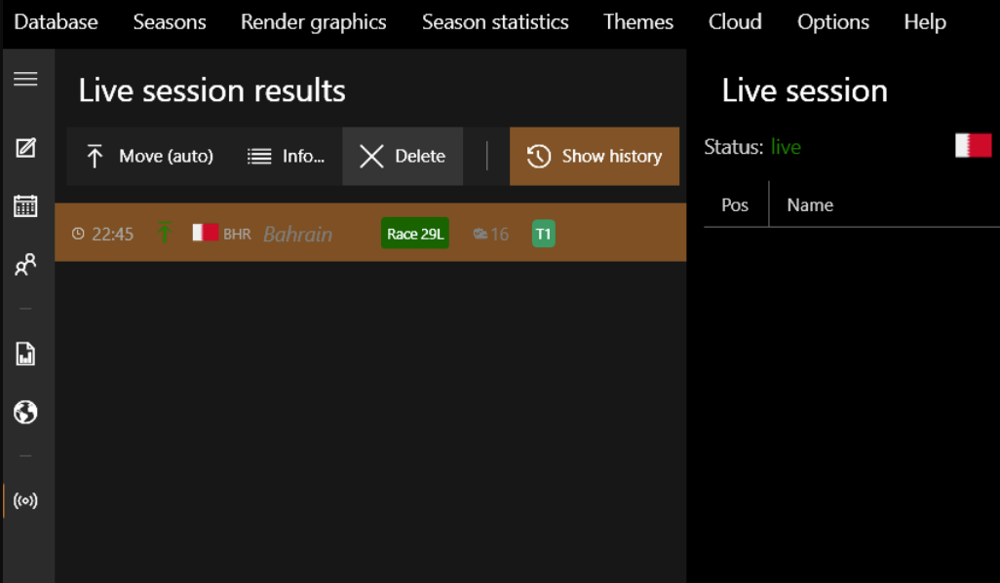
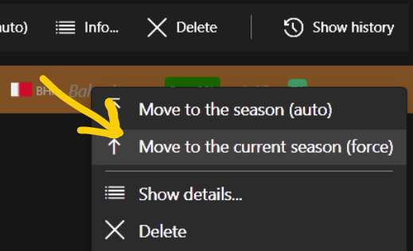
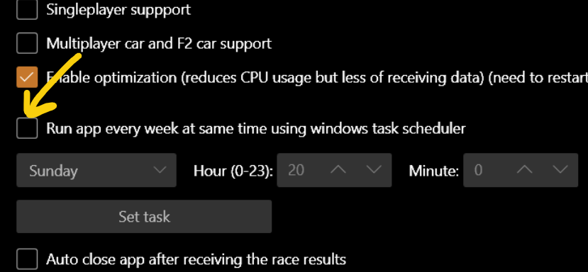
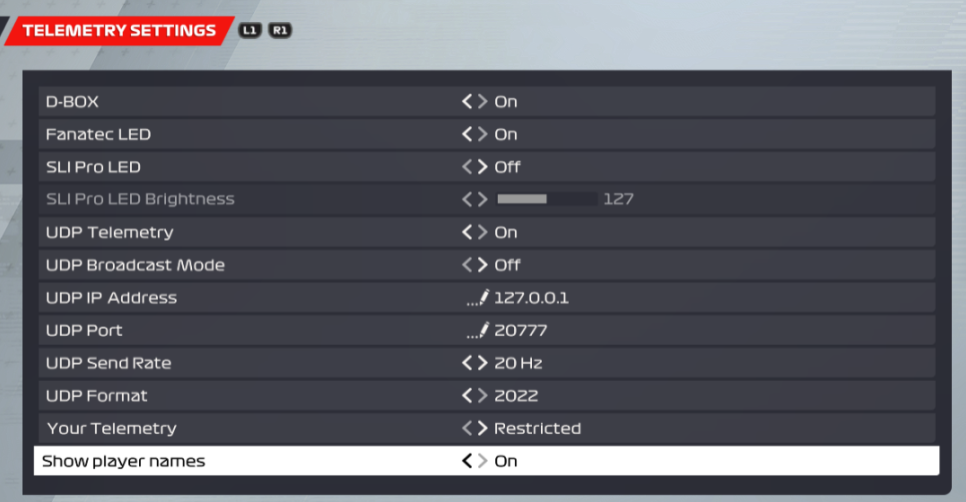
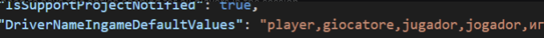

# Live Timing

Some hints related to live timing and remote telemetry.

Try to use the live timing feature as much as possible (available now for F1 game series, ACC games). See also the [video guide](https://youtu.be/AsySSbZypwE).
This is useful for statistics, including future statistics.

The vast majority of "disconnected" and "udp port is busy" problems are related to your system's firewall and antivirus.
When the app receives data from UDP telemetry you should see this (on the live timing page):



It's highly recommended to use the "Save udp dump" option (enabled by default):



## UDP dumps

When a live session finishes, a file is created with a dump of raw UDP packet data, which can then be replayed:



Such files can be tens of megabytes in size, but old files will be deleted automatically so as not to accumulate. In the future, it will be possible to open any such file if necessary:



The session will be replayed and the results will be accessible.

!!! note
    UDP dump files are stored in the `<app_root_folder>/user/udp_dumps/` folder. These files can be quite large. By default, the application deletes old files when the number specified in the settings is exceeded. You can also set a time limit by opening `app_config.json` and adding:

    ```
    "MaxDaysLiveDumpFiles": 30
    ```

    In this case, all dumps older than a month will be deleted when a new dump is saved.

## Live sessions

You don't have to join the game before the live session starts — it is enough to do it a few minutes before the end. Accordingly, you can have problems with disconnect during the session and still get results correctly.

For more info on driver matching and the extended driver matching option, see the [video guide](https://youtu.be/AsySSbZypwE).

It is always recommended to check the results of driver matching.
When you select a driver in the results obtained from a live session, the number and in-game nationality are automatically associated with the driver profile in order to improve driver matching in the future.

After the live session is over, its results will be processed and shown on the "Live session results" list:



The app will then try to automatically transfer the results to the season.
If you have several non-archived seasons, try to select in advance the season for which you are taking results from the game. Although the app tries to automatically determine the correct season, you can help with this choice.
If for some reason the app could not identify the season, you can forcibly transfer the results:



## Live timing in parallel

Cloud synchronization is currently imperfect. If different users use the live timing feature in parallel for the same cloud storage, synchronization problems can occur.
To minimize the risk of one user overwriting another user's results, it is recommended that you do the following:

- Enable the "Save udp dump" option **for all users**.
- The "Move live session to the season" option (in live timing options) should be enabled only for a **single user**; other users can disable it.
- Always check the results after the live sessions are over.

After syncing, you will be able to see the live session that other users have captured. As a last resort, a previously saved UDP dump will help.

To remember to launch the app before the event, you can use the Windows Scheduler:



## Driver name in-game (F1 22+)

Codemasters provide information about the driver name (in telemetry) only if the driver has the "Show player names" option enabled (disabled by default):



Therefore, to improve driver matching, this option must be enabled for all players in the session.
If anyone has this option disabled, the app will receive the **default driver name**, which can be localized depending on the language in which F1 22 is running (at the RLT host).

In the `app_config.json` file, the `DriverNameIngameDefaultValues` variable describes possible default names to ignore during processing:



In case you see the localized name "player" instead of the correct player name, you can add this string to that variable so that the app will also ignore it.

## Live status via HTTP

It is possible to get the current live status using an HTTP GET request.
To enable this, define the `LiveStatusHttpServerPort` property in `app_config.json`:

```
"LiveStatusHttpServerPort" : 41000
```

Then, by sending a GET request to `http://<ip_host>:<LiveStatusHttpServerPort>/`, the app returns JSON with the following fields:

```
public string ConnectionStatus { get; set; }
public bool IsConnected { get; set; }
public string SessionString { get; set; }
public string SessionType { get; set; }
public string QualificationType { get; set; }
public string TimingString { get; set; }
public string DatabaseName { get; set; }
public string LeagueName { get; set; }
public string ActiveSeasonName { get; set; }
public string AssumedLiveSeasonName { get; set; }
public string Game { get; set; }
```

## Prevent sleep and display off (Windows)

This can be useful when Racing League Tools is receiving UDP telemetry from a remote computer. Use this option in `app_config.json`:

```
"IsPreventSleepAndDisplayOff" : true
```
