# Penalty System

Racing League Tools has a powerful, flexible, automatized penalty system.

## Basic terms

- **PP** - penalty points.
- **PTS** - penalty time (seconds) by stewards.
- **PPS** - penalty positions by stewards.
- **PTG** - penalty time (seconds) in-game.
- **PPG** - penalty positions in-game.
- **W** - warning.

**Penalty item** - a specific penalty element that applies to a specific driver. Usually also associated with a specific session, although this is optional. Penalty item may include PP, PTS, PPS, W, etc.

**Penalty action** - a specific type of punishment, part of the penalty item. Can be applied immediately (such as drop driver championship points) or in the future (such as race ban).

**Penalty system** - a set of rules, allocated as a separate entity, can be named and applied to a specific season.

## How to issue penalty?

There are three options to add a new penalty to a specific driver:

- Directly on the session results table.
- Using "New penalty" window dialog (available on session results page).
- On "Penalties" page (by clicking on button "Add new penalty").

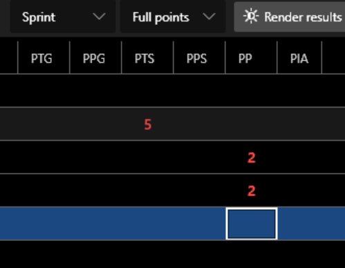

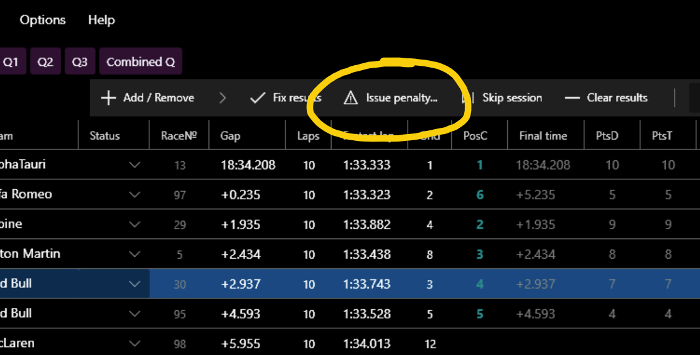

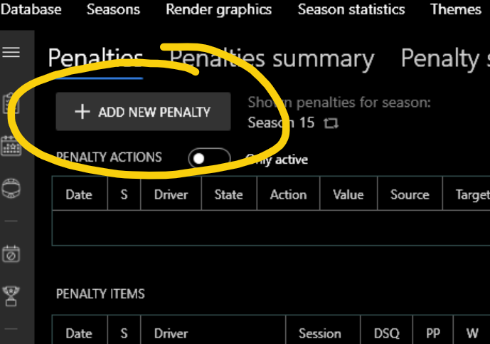

They are a little different. "**New penalty**" window or "**Penalties**" page provides much more opportunities and is more preferable. 

In complex cases, when the multi-season penalty points system is used, penalty points (PP) assigned in the session results table can be ignored. Therefore it is strongly recommended to use "**Issue penalty**" button or "**Add new penalty**" on "**Penalties**" page for adding new penalties where PP and warnings is different from zero.

Also, if you use option 1, don't forget to click "**Fix results**" button at the end so that the penalties are correctly processed.

## Penalty item

A penalty item is a separate item that is associated with a specific driver and season. It is also supposed to be associated with a specific session, but the app allows you to create a penalty item that may not be linked to any session.

It is important to understand that a penalty item is a separate item in the database, and PP, PTS, PPS which are set in the table of session results are NOT, they are just part of the result. For example, final PP is the sum of PP from the penalty items that is associated with the session and the driver and PP that was set directly in the session results table. This seeming complexity arose because a new penalty system was introduced in 0.8.1 and it was necessary to maintain backward compatibility.

### Common penalty item properties:

- **Driver** - the accused person.
- **Season** - always set, depends on the current season when creating a penalty.
- **Session** - can be empty, is set by default for the current session when using the "New penalty" window, or can be specified manually when adding on "Penalties" page.
- **Drivers involved** - drivers list affected/involved in the incident.
- **Offense** - text, can be empty. Can be associated with specific offense of pre-prepared list of offenses.
- **Details** - text, can be empty.
- **Decision** - text, can be empty.
- **Lap** - text, can be empty.
- **Turn** - text, can be empty.
- **Issuer** - user/staff member (is chosen from the general list of drivers) who issued the penalty.
- **Submitter** - user/staff member (is chosen from the general list of drivers) who submit the penalty.
- **Penalty ID** - text, penalty identifier.
- **Date** - defaults to the date of the session/event, but this can be overridden. Important in penalties processing.
- **Penalty time (seconds) (PTS)** - number, can be negative.
- **Penalty positions (PPS)** - number, can be negative.
- **Penalty points (PP)** - number, can be negative.
- **Warning (W)** - number. Zero or positive number. May have values greater than 1.
- **Session DSQ** - set/unset. If set, overrides the status of the driver in the session on DSQ.
- **No penalty/punishment** - set/unset. Indicate that the driver received no penalty for the incident, in which case all penalty values will be forcibly reset to zero.

## Penalty action

Defines an additional penalty for the driver. It's part of the penalty item, any penalty item may have 1 or more penalty actions.

*Action* is some action that is automatically applied by the app to the driver either immediately after the penalty is created or in the future.

- **Time penalty (sec.)** - applies PTS to the result of the specified or last (if session wasn't specified) driver race.
- **Position drop** - applies PPS to the result of the specified or last (if session wasn't specified) driver race.
- **Time penalty for the next driver's race (sec.)** - applies PTS to the next driver's race.
- **Position drop for the next driver's race** - applies PPS to the next driver's race.
- **Grid position drop for the next driver's race** - *does not apply automatically!* Serves only to notify about this punishment.
- **Start from pitlane for the next driver's race** - *does not apply automatically!* Serves only to notify about this punishment.
- **Qualification ban / Race ban** - ban for the next qualification or race. If the driver will be selected in the results, the notification will appear and the status will automatically be set to DSQ.
- **Event ban** - similarly qualification / race ban, only for all sessions of the next event.
- **Season ban** - event ban for all next events of the season.
- **League ban** - event ban for all next events of all current and next seasons.
- **Driver / Team championship points drop** - reduces championship points.
- **Carryover penalty points to the next season** - transfers the specified number of PP to the next season.
- **DSQ for the current / last session or event** - sets DSQ status for specific or last session or all sessions of event.

*Note: for some actions you can specify a value.*

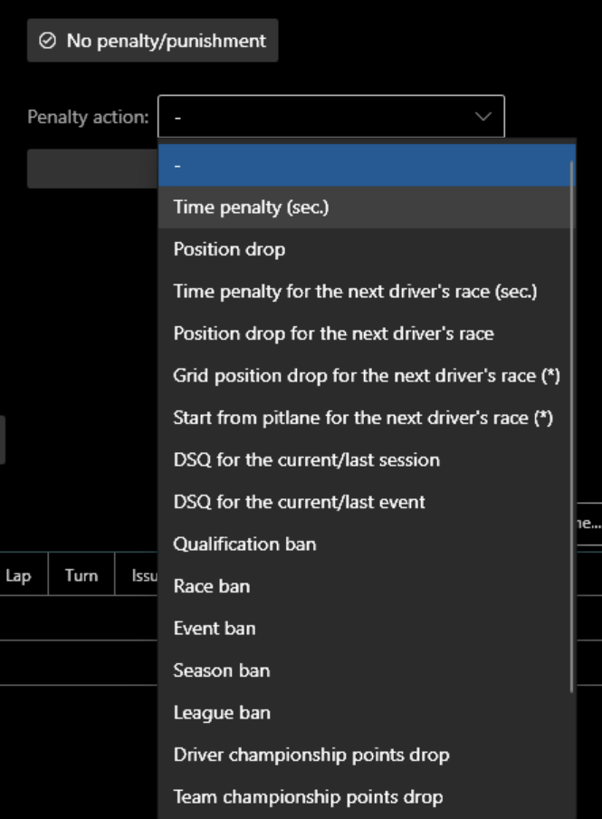

Penalty action is always in one of three statuses:

- *active* : means that the penalty action is either in effect now (e.g. 'league ban') or will be in effect in the future (e.g. 'race ban').
- *applied* : means that the penalty action has already been applied and will not be used in the future.
- *cancelled* : means that the penalty action was canceled by the user.
- *failed* : means that the attempt to apply the penalty action was unsuccessful, the penalty action is inactive.

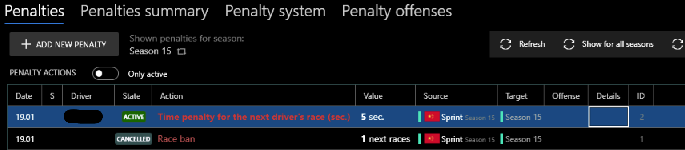

Penalty action may have a *source* session/season and a *target* session/season.

*Source* - typically refers to the session or season that the parent penalty item is associated with.
*Target* - can be a specific session, a season or multiple seasons, depending on the type of penalty action and its status.

**It is important to understand that the penalty action may NOT always be associated with only one specific season.**

There may be different seasons in the database, taking place at different times, divided into different categories, the same driver may simultaneously participate in different seasons and, as a consequence, a penalty may need to be applied to several different seasons. For such purposes, there are penalty system options that can extend the penalty action over several seasons. Therefore, the target of penalty action may include several different seasons.

### Examples:

- **Penalty action "Race ban"**: SomeDriver participated in season 1 and season 2 as the primary driver. In race 1 he gets a race ban for 1 race. Penalty system has option "**Actions area**" set to "**All Seasons**". Penalty action will have the target: *{next race}* in season 1 and *{next race}* in season 2. *{Next race}* is the next race relative to the date of the source session of penalty action. If SomeDriver is is chosen in the results of race 2 (*{next race}*), which is subject to the race ban, he will automatically receive DSQ status.

- **Penalty action "Driver championship points drop" (5 pts)**: at the moment of saving a penalty item that will include this penalty action, the app will offer to apply this action. If the user agrees, the app will automatically deduct 5 points for the driver for the season that is associated with the penalty item and consequently with the penalty action. This season will be *"target"* of penalty action.

- **Penalty action "Carryover penalty points to the next season" (1 pts)**: at the moment of saving a penalty item that will include this penalty action, the "*target*" will be marked as a *{next season}*. *{Next season}* in this case is the season that will start after the end of the season, which is associated with penalty action. 1 penalty point will be automatically added at the time the driver is first chosen in the {next season} results.

- **Penalty action "Time penalty" (5 sec.)**: basically duplicates **PTS** value because it also applies to the session associated with the penalty item/action. However, this is necessary for penalty actions generated automatically in cases of penalty point thresholds.

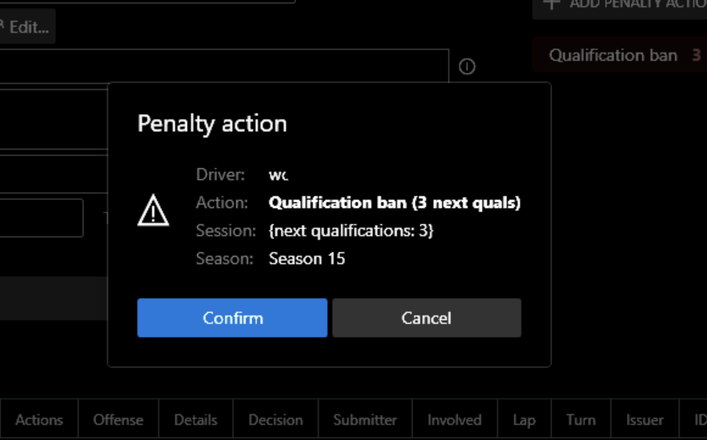

## Offenses

You can save the entire offense list of your league in advance using "Penalty offenses" tab:

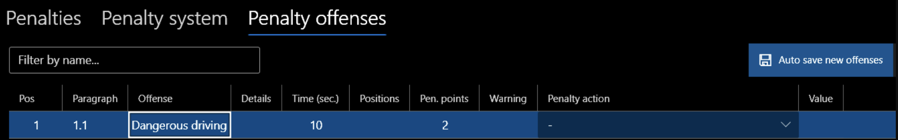

Then all you need to do is choose the desired *offense* from the list and the penalty values associated with it will be automatically applied.

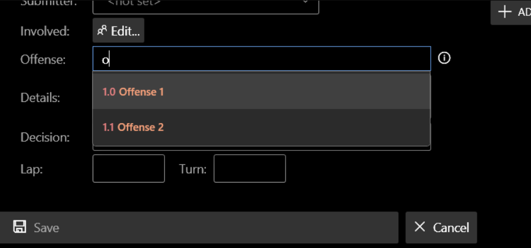

*Notes:*
- **Penalty item** stores offense in text form. It can also store a reference to a penalty offense object that was created beforehand. 
- You can change offense text, even after you have linked a penalty item with a specific penalty offense, it would still be a linked with penalty offense.
- You do NOT necessarily have to choose from an existing list of offenses. This is an additional option to assist you.
- It is possible to export/import the list of offenses. This allows you to quickly copy league rules between leagues.

There is an option to automatically save offense when you save a new penalty item. This option is linked to the current season's penalty system, although it is on penalty offenses tab. Saving will be done if there is no penalty offense with the same offense in the database. In any case, a confirmation dialog will be shown.

**Offense**, **Details**, **Decision** properties support the substitution of the driver name in the text. This is useful for generating text that can automatically use discord profile links to ping drivers.
Use curly brackets for substitution, e.g.: "{DriverNameA} pushed {DriverNameB} and {1}", where:
- *{DriverNameA}* - name of driver A.
- *{DriverNameB}* - name of driver B.
- *{1}* - the serial number of the driver in the list of drivers involved.

## Penalty cancelling

You can cancel any penalty item or penalty action. In this case the item will remain in the database, but it will not be inactive.
To do this, call the context menu on the penalty item/penalty action list (right mouse click) and select "Cancel penalty". If it possible, penalty action effect will also be canceled/reset.

## Penalty system

You can create a penalty system on the relevant page. A league can contain as many different penalty systems as you want. A specific season may refer to only one penalty system, but different seasons may refer to the same penalty system.

*Note: by default, when you create a new season, if there is a created penalty system in the database, and it is one, the new season will also refer to that system.*

*Any season may NOT have any reference to a penalty system. In this case you can still create penalty items or actions, but there will be NO automatic processing for that season, excluding penalty action processing within source season.*

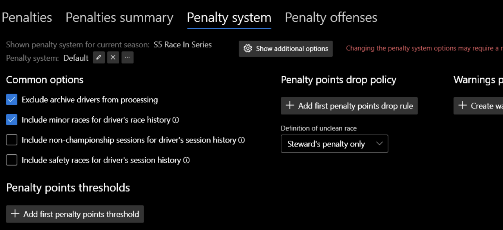

Penalty system has a wide variety of options that allow for flexibility in customizing the system to meet the needs of different leagues.

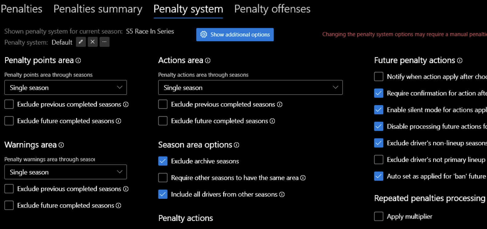

## Seasons area

In order for penalty points (PP), warnings (W) or penalty action (PA) to apply NOT only to 1 season (*source* season of penalty item/action) but also to other seasons, there are options called "seasons area":

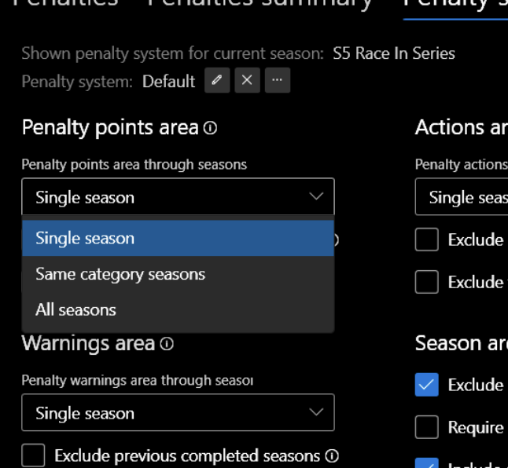

There are 3 values of these options:

- **Single season** - all PP/W/PA are valid for a single season.
- **Same category seasons** - PP/W/PA are common to seasons that have the same category.
- **All** - same, but for all seasons of the league.

*Note: this option has quite a serious effect on the processing of penalties. If possible, use "single season", for faster and more predictable processing.*

Other penalty system options can additionally reduce the number of seasons involved in processing (for example, "**Exclude archive seasons**").

## Penalty points drop policy

You can create one or more drop policies so that penalty points are automatically subtracted when an event occurs. Order matters in processing.

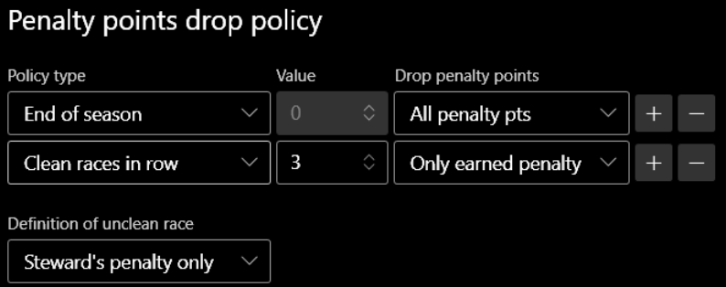

Policy types:

- **Penalty points reached** - it's useful when your league has the highest penalty points threshold, and when that limit is reached, the penalty points would automatically reset to zero.
- **Number of races / events reached** - set the lifetime of each issued penalty item with above zero penalty points. When the specified number of races or events (within the league, not the driver) is reached, the penalty points are deactivated. Only "Only earned penalty" option is available.
- **Time expired (days)** - set the lifetime of each issued penalty item with above zero penalty points. Only "Only earned penalty" option is available.
- **End of season**
- **Clean races / events in row**
- **Participating in Safety race** - safety race is a race for which the race type is set as **Safety**.

*A few notes on the "**Clean races / events in row**" policy:*

**Definition of unclean race** option - can be "**steward's penalty only**", "**in-game's penalty only**", "**steward's or in-game's penalty**".

For "**steward's penalty**" any positive values of PP, PTS, PPS, W, as well as the set penalty action are taken into account.
If the driver has DSQ status, it is considered a unclean session. If the driver is clean, but is not classified, this session misses in the count.

For "**clean events in row**" policy it is important to classify in the major race of the event, so that the event will be taken into account for the driver. However, any unclean session, including qualification, will automatically make the event unclean.

To determine which PP are active and which were dropped, you can navigate to the table latest penalties, filtering it by the desired driver. Dropped penalties will be highlighted in gray.

## Warnings policy

The app implies the use of the warnings in order to convert it into penalty points in the future when it reaches a certain limit. You can create an appropriate policy specifying this limit and the number of penalty points to be issued:

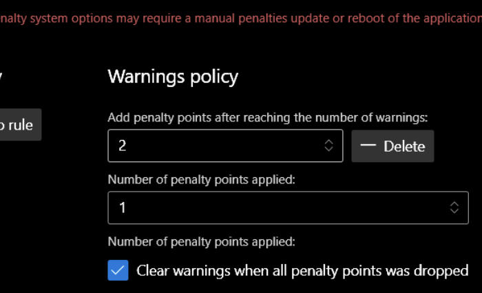

There is also an option to clear warnings when the drop policy is triggered, which deactivates all penalty points.

## Repeated penalties

In order to increase the value of the penalty for the same rule violations, the app can automatically multiply penalty values (seconds, positions, PP). The offense field is used as an indication of the same violation, which must be the same for different penalty items.
Penalty backward zone defines the zone within which the repeated violation is monitored.

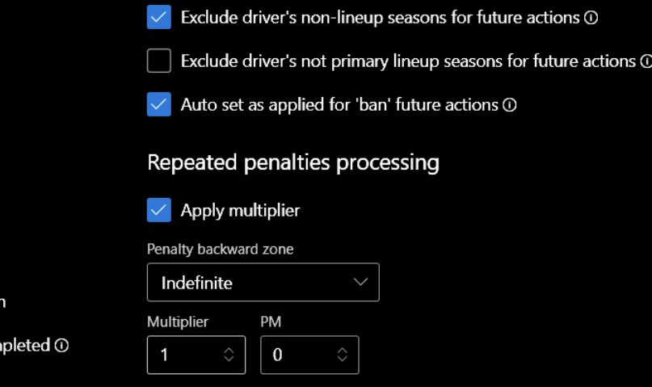

Progressive multiplier (PM) is used to multiply the base multiplier each time the penalty repeats within the backward zone. Default value is 0 or 1 (is not applied). For example, if PM is set to 2 and base multiplier is set to 2 too, penalty for a repeated violation will be as follows:
1st: 3 sec. (base), 2nd: 3\*2=6 sec., 3rd: 3\*2\*2=12 sec., 4th: 3\*2\*2\*2=24 sec, etc.

## Penalty points thresholds

To automatically trigger an additional penalty for the driver when reaching a certain limit of penalty points, a system of penalty points thresholds is used. You can create an unlimited number of limits/thresholds and assign two different penalty actions to them:

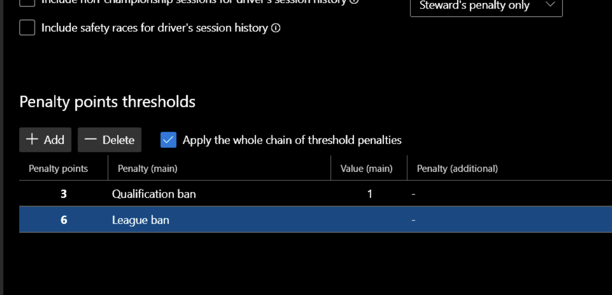

**Apply the whole chain of threshold penalties** - allows to apply several actions at once. For example, if the driver receives 5 PP at a moment and the penalty system defines thresholds at 2 PP and 5 PP, the actions defined for 2 and 5 PP thresholds will be applied to the driver.

When driver's PP reached certain threshold, the new penalty item will be automatically issued, contains certain penalty action.

## Penalty rendering

Penalty can be exported / visualized in two ways, via rendering (supports custom themes) or via text generation.
Rendering is supported:

- Penalties event list (all penalty items of all sessions of specific event).
- Single penalty item.
- Season's penalty driver statistics (sum of PP, W, PTS, etc per each driver).

You can run rendering on session results page:

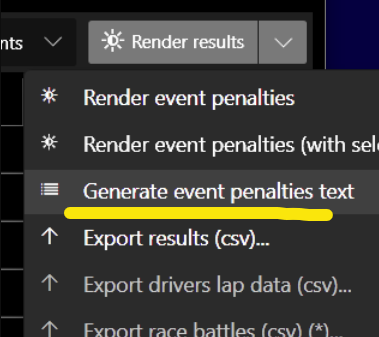

...or on "Penalties" page:

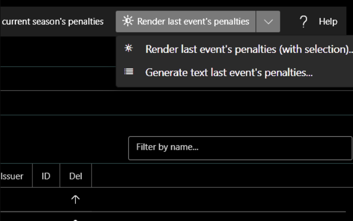

Also on "Penalties" page you can open "Penalties text generation" window. This will allow you to generate the text of the penalty list of events according to a certain template:

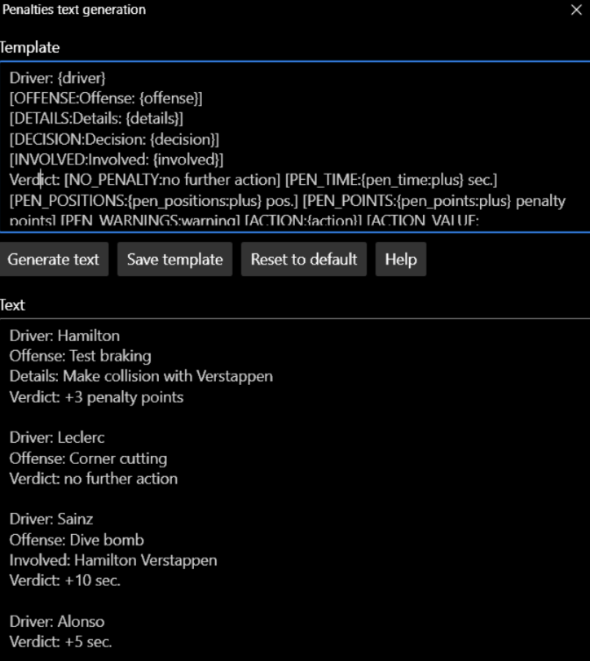

## FAQ

> **Why are penalties (penalty actions) not automatically applied for the following sessions?**

Probably the session results were obtained from live timing / imported from files and automatic driver matching was used. In this case, the app does not apply a penalty action by default. The option in penalty system:

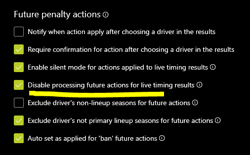

It possible to uncheck it.

