# Sessions

Some hints related to sessions and the session results page.

## Calendar — managing sessions

You can easily add and remove different sessions for an event on the **Calendar** page:

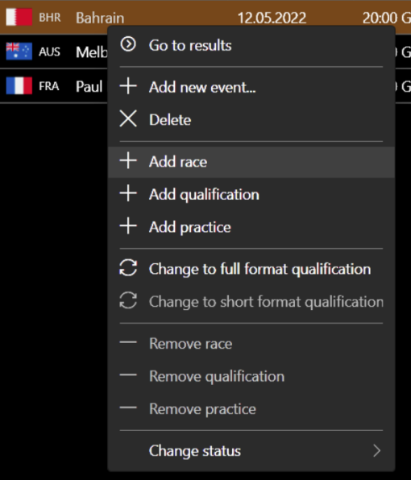

Here you can also change the status of any event to non-championship:

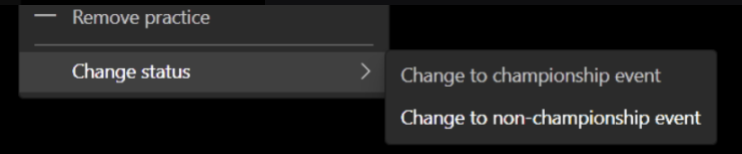

Non-championship status means that all sessions within that event are not processed for standings and statistics.

## Results page

When typing any letter in the driver field, the app searches for matches in driver names, real names, and in-game names:

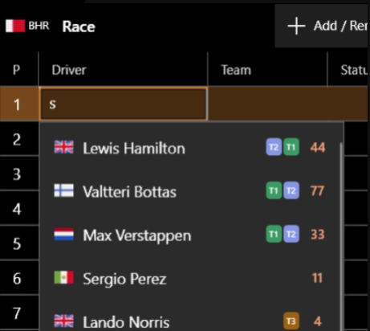

It's very easy to enter a time/gap value:

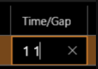

...which converts to:

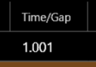

Just try it.

## Classification position

It is not necessary to enter all information — just drivers, teams, and statuses.
The key field in session results is the **classification position**:

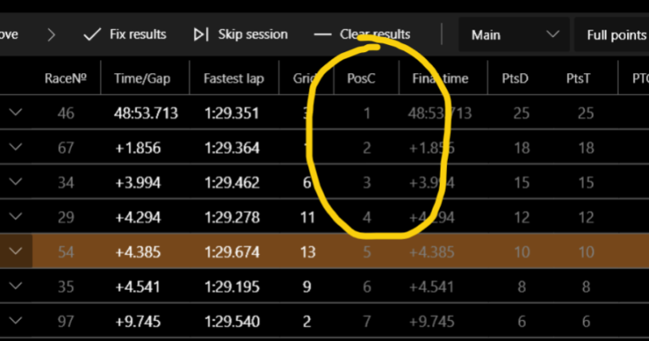

It is calculated **automatically**. Its value depends directly on the times and gaps.
The following are also taken into account:

- DNF, DSQ status
- PTS (penalty time from stewards)
- PPS (penalty positions from stewards)

PTG (penalty time from the game) and PPG (penalty positions from the game) are **not** taken into account — it is assumed that they are already accounted for by the game.

PP (penalty points) is only needed for the season's statistics.

**If you want to remove penalty time issued by the game, just enter a negative value in the PTS field:**

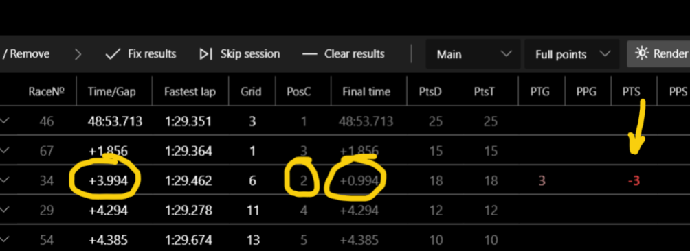

The app uses a pretty advanced classification position processor, so try to manage results using PTS and PPS.

## Sessions management

Try to fill results into events *consistently*:

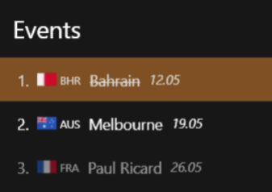

Completing qualifying and practice results is **not** as important as completing **race results**.
You can skip sessions if necessary:

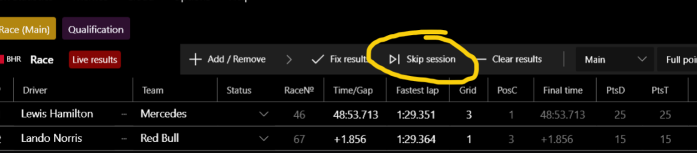

## Fix results button

You don't always have to click the "Fix results" button:

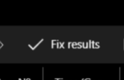

It is only needed to update the UI and standings within the app. When you press **Render**, fix results happen automatically.

## Session type

The type of session is important for the calculation of points and statistics:

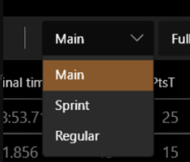

You can change it at any time.

## Qualification format

You can also change to full format or short format at any time for a qualification session:

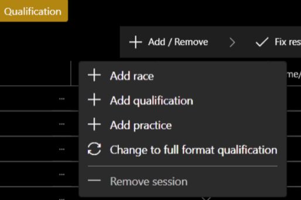

For the full qualification format, a separate virtual session is created with the combined results of all segments:

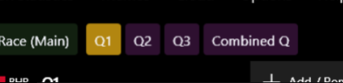

However, it is not necessary to select the "Combined Q" tab to render combined results.
You can simply click the **Render results** button while on any qualification tab.
If you want to render a specific segment, find the appropriate button in the render drop-down menu:

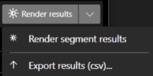

For faster rendering, use the main menu:

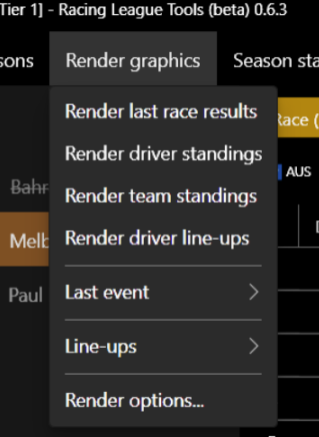

## Adding new drivers in results

If you need to enter a new driver in the session results, you can immediately create a new driver:

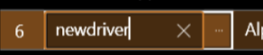

Enter the driver's name and press **Enter**. The driver will be created and selected.
To easily add or remove a driver's penalty, use the context menu:

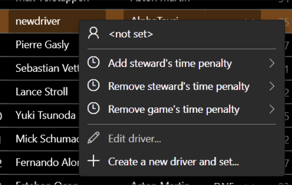

## Tyre stints

To edit tyre stints, open `app_config.json` and add the following line, then restart the app:

```
"IsEnableTyreStintsManualEdit": true
```
